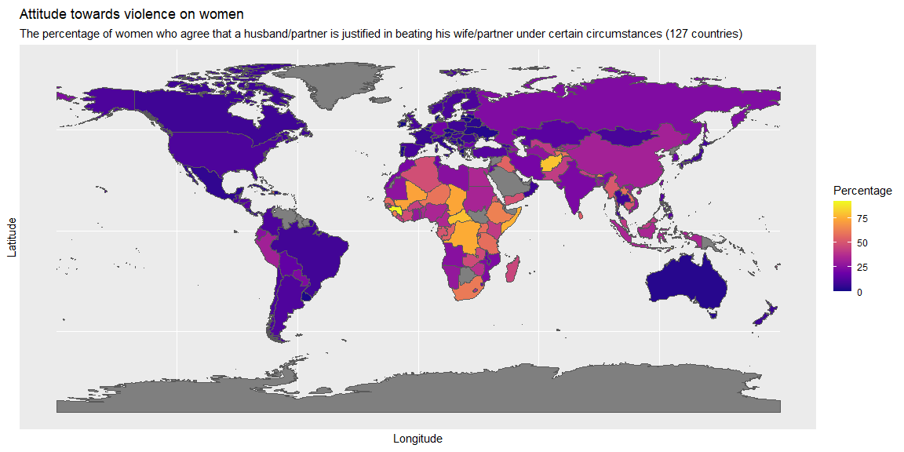
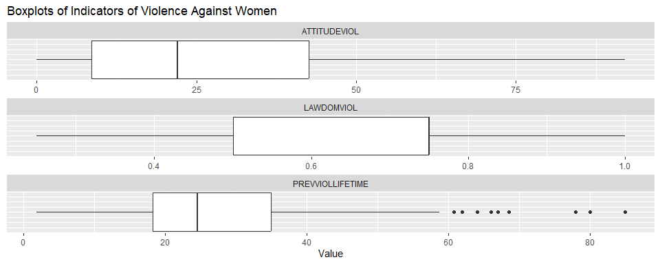

# Check out the [HTML Version](https://jakubjurkovic.github.io/Data-Science/)

# Markers, causes and correlations of Violence against women
## Insight on how war, child marriages and education affect violence against women
  
Authors:
  - name: Vanessa Robinson
  - name: Jakub Jurkovic
  - name: Arya Gautam

**Word count: 5710**

# Introduction

Violence against women, also known as gender based violence (GBV), refers to violent acts committed against girls or women specifically because of their sex and/or gender (1). The United Nations (UN) estimates that one in three women worldwide have been subjected to some form of physical and/or sexual violence during their lifetimes by either an intimate partner or non-partner, and is therefore a major public health concern. The UN also reports that most cases of sexual and physical violence against women are perpetrated by men. (1)

Gender based aggression that results in violence is often rooted in a patriarchal and misogynist societal framework, wherein violence is used as a means to control and subjugate women. Patriarchal notions of gender roles and hierarchies inform the construction of a traditional masculinity that expects and encourages male aggression and dominance over women. Social, cultural and religious influences that bolster the position of men over women at an individual, familial, and societal level produces an environment that is conducive to violence against women (2). A study by Sikweyiya et al., found that men who employ various forms of violence against their female partners were performing or aspiring to achieve a form of masculinity that is rooted in male superiority. These men believed that decision-making is a male prerogative, expected complete obedience from their wives, and held perceptions about owning their female partners (3). As such, they viewed violence as legitimate and even necessary to "discipline women".

Exposure to violence during childhood or inter-generational exposure to violence, low levels of education among both men and women, and alcohol abuse are among some key factors identified by researchers over the years that increase women's risk of experiencing violence. Likewise, economic dependence of women to their male partners, and lack of social and legal repercussions to perpetrators also increase the rates of violence against women (2). In this report, we wish to investigate the relationship of educational level of women, marriage age of women and political (in)stability and violence against women. 


# Theory/Hypotheses

First, we will investigate the relationship between child marriage and violence against women. Child Marriage refers to the formal or informal union between a child and another child or adult. UNICEF lists child and forced marriage (CFM) as a human rights violation. It is estimated that globally, about 34 percent of young girls (20-24) were married under the age of 18, and 12 percent of them were married before the age of 15 between 2000-2011 (6). Child marriage is associated with high rates of adolescent pregnancies, which in turn increases both maternal and infant mortality rates. It has also been linked to several adverse physical and mental health outcomes, including but not limited to psychiatric disorders and reproductive diseases. Child brides are often robbed of their rights to education, health and public participation (7). We believe that child marriage also increases risk of domestic and intimate partner violence. In a majority of child marriages around the world, young girls are married to significantly older men. Such relationships inherently consist of power imbalance, whereby young girls have much lower bargaining power (8). They are often economically dependent on their older spouses and unaware about the resources available to extradite themselves from abusive relationships. Moreover, they are subjected to spousal subjugation which diminishes their autonomy and mobility. These factors put them at a much elevated risk for domestic and IPV. A study done by Rachel Kidman in 2017 highlighted that although the link between child marriage and IPV has been suggested, the evidence on the relationship has not been definitive. Moreover, the report suggests that there have only been a few studies outside South Asia that investigates the relationship between child marriage and domestic violence (8). This paper explores the relationship between child marriage and domestic violence across the world. Our first hypothesis is therefore that child marriages lead to an increase in violence against women. 

Next, we will examine the effect of conflicts or wars on violence against women. Most often during conflicts, marginalized people tend to receive the brunt of the negative effects of the conflict whether that be higher death rates, lower economic wealth, or seeing an increase in the amount of violence against them. According to the Office of the High Commissioner for Human Rights, which is the leading UN entity of human rights, "Conflict can result in higher levels of gender-based violence against women and girls, including arbitrary killings, torture, sexual violence and forced marriage. Women and girls are primarily and increasingly targeted by the use of sexual violence, including as a tactic of war" (10). Several other studies have attempted this effect on a country-level scale. One study administered a questionnaire to investigate how Lebanese women were affected by the July 2006 conflict that erupted between the Hezbollah and the Sae of Israel, with a specific focus on their personal violence exposure and how they coped with these circumstances (11). They found that of the women who completed the questionnaire, 89% had to leave their homes during the conflict because of fear or worry about safety. Of the 310 participants, 39% reported at least one encounter with violence perpetrated by soldiers, 27% reported at least one incident of domestic abuse during the conflict, and 13% reported at least one incident after the conflict perpetrated by their husbands or other family members (11). A similar phenomenon was captured in the eastern Democratic Republic of Congo; the researchers found that as miliaries activities increased in one area after another, so do rapes and other crimes against women and girls (12). Although there is a rich library of literature that look into the relationship between conflict and violence against women on a country-level, the literature that examines this relationship on a global scale seems to be lacking, which is why we will take this opportunity to examine it. Our second hypotheses is that conflict, or war, will increase violence against women.

Finally, we will look into how education levels among both men and women affect violence against women around the world. Education plays a major role in shaping people's attitudes towards women. It can be a means for promoting gender equality, which can in turn decrease violence against women. Education can, in fact, have a two-fold effect: educated women are more aware of their rights and are better equipped to defend themselves from potential violence, and educated men are more likely to have positive attitudes towards women as well as be more aware of the consequences their actions carry. A case study done in Uganda shows a strong link on how the tertiary education of females positively impacts the prevalence of violence against women (20). Additionally, a recent study by Jeyaseelan at al., reported that individuals with lower levels of education may resort to violence due to the inability to properly communicate anger or frustration (22). We are interested in finding out if such a trend between education and violence is observable on a global scale. Our third hypotheses is therefore that education will reduce rates of violence against women.

In summary, we hypothesize that: 
1. Child marriage increases the rates of violence against women. 
2. Political instability or wars increase the rates of violence against women.
3. Higher education rates, and better gender parity decreases the rates of violence against women. 

# Methods

As our dependent variables, we have three indicators of violence against women reported by the OECD database. OECD as an organization is an economic forum that promotes policies with the intent of improving the economic and social well-being of people around the globe. As a part of their commitment, they gather a multitude of data in pursuit of benchmarking different countries and the living situations of their residents. They gather data on alleged markers of violence against women. The OECD data set we use in our paper, as a measure of violence against women across the world, includes three markers: attitude toward violence, which gives the percentage of women that agree that a husband/partner is justified in beating his wife/partner under certain circumstances; prevalence of violence during lifetime, which measures the percentage of women who have experienced physical and/or sexual violence from an intimate partner at some time in their life and Laws on domestic violence, which evaluates the degree of discrimination embedded in the laws, ranging from 0 to 1, whereby 0 means 0 means that laws or practices do not discriminate against women's rights and 1 means laws or practices fully discriminate against women's rights (4).

In the first part of our analysis, we will perform an exploratory analysis of the three given indicators to find patterns they reveal about violence against women. In particular, we will visualize each of the indicator and look into their summary statistics in order to learn their individual strengths and weaknesses. Then, we will examine relationships among the three indicators. Depending on our results, we will select one indicator out of the three to perform all downstream analyses (i.e. explore the relationship between the desired indicator and our selected variables). 

In the second part of our analysis, we will investigate the relationship between our selected variables (child marriage, education levels, and political instability) and a domestic violence indicator. To do so, we will first run a regression between the individual variables and the indicator using the brms package to determine the effect size of these variables on domestic violence against women. Next, we will run a correlation model to examine the correlation score (r) and the p-value in order to determine its correlation strength and statistical significance. We will also explore casual mechanisms between our variables of interest and domestic violence. We will draw upon existing literature to build our theory about the said causal mechanisms. We will then examine the effect of confounding variable(s) (if any), where possible, in order to confirm our causal models. Finally, based on our results, we will either confirm or deny our postulated hypotheses. 

# Data Analysis and Interpretation

## Exploration of OECD indicators

Visualizations of the three OECD indicators for violence against women:

<div class="layout-chunk" data-layout="l-page">
<details>
<summary>Show code</summary>
<div class="sourceCode"><pre class="sourceCode r"><code class="sourceCode r"><span><span class='fu'><a href='https://ggplot2.tidyverse.org/reference/ggplot.html'>ggplot</a></span><span class='op'>(</span>data <span class='op'>=</span> <span class='va'>oecd_mapped</span><span class='op'>)</span> <span class='op'>+</span></span>
<span>    <span class='fu'><a href='https://ggplot2.tidyverse.org/reference/ggsf.html'>geom_sf</a></span><span class='op'>(</span><span class='fu'><a href='https://ggplot2.tidyverse.org/reference/aes.html'>aes</a></span><span class='op'>(</span>fill<span class='op'>=</span><span class='va'>LAWDOMVIOL</span><span class='op'>)</span><span class='op'>)</span> <span class='op'>+</span></span>
<span>    <span class='fu'><a href='https://ggplot2.tidyverse.org/reference/scale_viridis.html'>scale_fill_viridis_c</a></span><span class='op'>(</span>option <span class='op'>=</span> <span class='st'>"C"</span><span class='op'>)</span> <span class='op'>+</span></span>
<span>    <span class='fu'><a href='https://ggplot2.tidyverse.org/reference/labs.html'>xlab</a></span><span class='op'>(</span><span class='st'>"Longitude"</span><span class='op'>)</span> <span class='op'>+</span> <span class='fu'><a href='https://ggplot2.tidyverse.org/reference/labs.html'>ylab</a></span><span class='op'>(</span><span class='st'>"Latitude"</span><span class='op'>)</span> <span class='op'>+</span></span>
<span>    <span class='fu'><a href='https://ggplot2.tidyverse.org/reference/labs.html'>labs</a></span><span class='op'>(</span></span>
<span>      title <span class='op'>=</span> <span class='st'>"Discrimination against women's right within law and policies"</span>,</span>
<span>      subtitle <span class='op'>=</span> <span class='st'>"Lower is better"</span>,</span>
<span>      fill <span class='op'>=</span> <span class='st'>"Index value"</span></span>
<span>    <span class='op'>)</span></span></code></pre></div>

</details>

</div>


<div class="layout-chunk" data-layout="l-page">
<details>
<summary>Show code</summary>
<div class="sourceCode"><pre class="sourceCode r"><code class="sourceCode r"><span><span class='fu'><a href='https://ggplot2.tidyverse.org/reference/ggplot.html'>ggplot</a></span><span class='op'>(</span>data <span class='op'>=</span> <span class='va'>oecd_mapped</span><span class='op'>)</span> <span class='op'>+</span></span>
<span>    <span class='fu'><a href='https://ggplot2.tidyverse.org/reference/ggsf.html'>geom_sf</a></span><span class='op'>(</span><span class='fu'><a href='https://ggplot2.tidyverse.org/reference/aes.html'>aes</a></span><span class='op'>(</span>fill<span class='op'>=</span><span class='va'>ATTITUDEVIOL</span><span class='op'>)</span><span class='op'>)</span> <span class='op'>+</span></span>
<span>    <span class='fu'><a href='https://ggplot2.tidyverse.org/reference/scale_viridis.html'>scale_fill_viridis_c</a></span><span class='op'>(</span>option <span class='op'>=</span> <span class='st'>"C"</span><span class='op'>)</span> <span class='op'>+</span></span>
<span>    <span class='fu'><a href='https://ggplot2.tidyverse.org/reference/labs.html'>xlab</a></span><span class='op'>(</span><span class='st'>"Longitude"</span><span class='op'>)</span> <span class='op'>+</span> <span class='fu'><a href='https://ggplot2.tidyverse.org/reference/labs.html'>ylab</a></span><span class='op'>(</span><span class='st'>"Latitude"</span><span class='op'>)</span> <span class='op'>+</span></span>
<span>    <span class='fu'><a href='https://ggplot2.tidyverse.org/reference/labs.html'>ggtitle</a></span><span class='op'>(</span><span class='st'>"Attitude towards violence on women"</span>, subtitle <span class='op'>=</span> <span class='fu'><a href='https://rdrr.io/r/base/paste.html'>paste0</a></span><span class='op'>(</span><span class='st'>"The percentage of women who agree that a husband/partner is justified in beating his wife/partner under certain circumstances ("</span>, <span class='fu'><a href='https://rdrr.io/r/base/length.html'>length</a></span><span class='op'>(</span><span class='fu'><a href='https://rdrr.io/r/base/unique.html'>unique</a></span><span class='op'>(</span><span class='va'>oecd_mapped</span><span class='op'>$</span><span class='va'>ATTITUDEVIOL</span><span class='op'>)</span><span class='op'>)</span>, <span class='st'>" countries)"</span><span class='op'>)</span><span class='op'>)</span> <span class='op'>+</span></span>
<span>    <span class='fu'><a href='https://ggplot2.tidyverse.org/reference/labs.html'>labs</a></span><span class='op'>(</span></span>
<span>      fill <span class='op'>=</span> <span class='st'>"Percentage"</span></span>
<span>    <span class='op'>)</span></span></code></pre></div>

</details>

</div>


<div class="layout-chunk" data-layout="l-page">
<details>
<summary>Show code</summary>
<div class="sourceCode"><pre class="sourceCode r"><code class="sourceCode r"><span><span class='fu'><a href='https://ggplot2.tidyverse.org/reference/ggplot.html'>ggplot</a></span><span class='op'>(</span>data <span class='op'>=</span> <span class='va'>oecd_mapped</span><span class='op'>)</span> <span class='op'>+</span></span>
<span>    <span class='fu'><a href='https://ggplot2.tidyverse.org/reference/ggsf.html'>geom_sf</a></span><span class='op'>(</span><span class='fu'><a href='https://ggplot2.tidyverse.org/reference/aes.html'>aes</a></span><span class='op'>(</span>fill<span class='op'>=</span><span class='va'>PREVVIOLLIFETIME</span><span class='op'>)</span><span class='op'>)</span> <span class='op'>+</span></span>
<span>    <span class='fu'><a href='https://ggplot2.tidyverse.org/reference/scale_viridis.html'>scale_fill_viridis_c</a></span><span class='op'>(</span>option <span class='op'>=</span> <span class='st'>"C"</span><span class='op'>)</span> <span class='op'>+</span></span>
<span>    <span class='fu'><a href='https://ggplot2.tidyverse.org/reference/labs.html'>xlab</a></span><span class='op'>(</span><span class='st'>"Longitude"</span><span class='op'>)</span> <span class='op'>+</span> <span class='fu'><a href='https://ggplot2.tidyverse.org/reference/labs.html'>ylab</a></span><span class='op'>(</span><span class='st'>"Latitude"</span><span class='op'>)</span> <span class='op'>+</span></span>
<span>    <span class='fu'><a href='https://ggplot2.tidyverse.org/reference/labs.html'>ggtitle</a></span><span class='op'>(</span><span class='st'>"Prevalence in a lifetime"</span>, subtitle <span class='op'>=</span> <span class='fu'><a href='https://rdrr.io/r/base/paste.html'>paste0</a></span><span class='op'>(</span><span class='st'>"The percentage of women who experienced physical and/or sexual violence by their intimate partners ("</span>, <span class='fu'><a href='https://rdrr.io/r/base/length.html'>length</a></span><span class='op'>(</span><span class='fu'><a href='https://rdrr.io/r/base/unique.html'>unique</a></span><span class='op'>(</span><span class='va'>data_wide</span><span class='op'>$</span><span class='va'>LOCATION</span><span class='op'>)</span><span class='op'>)</span>, <span class='st'>" countries)"</span><span class='op'>)</span><span class='op'>)</span> <span class='op'>+</span></span>
<span>    <span class='fu'><a href='https://ggplot2.tidyverse.org/reference/labs.html'>labs</a></span><span class='op'>(</span></span>
<span>      fill <span class='op'>=</span> <span class='st'>"Percentage"</span></span>
<span>    <span class='op'>)</span></span></code></pre></div>

</details>

</div>


Summary Statistics for three OECD indicators of violence against women:

<div class="layout-chunk" data-layout="l-body-outset">
<details>
<summary>Show code</summary>
<div class="sourceCode"><pre class="sourceCode r"><code class="sourceCode r"><span><span class='va'>violence</span> <span class='op'><a href='https://magrittr.tidyverse.org/reference/pipe.html'>%&gt;%</a></span> </span>
<span>  <span class='fu'><a href='https://tidyr.tidyverse.org/reference/drop_na.html'>drop_na</a></span><span class='op'>(</span><span class='va'>ATTITUDEVIOL</span><span class='op'>)</span> <span class='op'><a href='https://magrittr.tidyverse.org/reference/pipe.html'>%&gt;%</a></span> </span>
<span>  <span class='fu'><a href='https://dplyr.tidyverse.org/reference/summarise.html'>summarise</a></span><span class='op'>(</span></span>
<span>    min_attitude <span class='op'>=</span> <span class='fu'><a href='https://rdrr.io/r/base/Extremes.html'>min</a></span><span class='op'>(</span><span class='va'>ATTITUDEVIOL</span><span class='op'>)</span>,</span>
<span>    mean_attitude <span class='op'>=</span> <span class='fu'><a href='https://rdrr.io/r/base/mean.html'>mean</a></span><span class='op'>(</span><span class='va'>ATTITUDEVIOL</span><span class='op'>)</span>,</span>
<span>    median_attitude <span class='op'>=</span> <span class='fu'><a href='https://rdrr.io/r/stats/median.html'>median</a></span><span class='op'>(</span><span class='va'>ATTITUDEVIOL</span><span class='op'>)</span>,</span>
<span>    max_attitude <span class='op'>=</span> <span class='fu'><a href='https://rdrr.io/r/base/Extremes.html'>max</a></span><span class='op'>(</span><span class='va'>ATTITUDEVIOL</span><span class='op'>)</span></span>
<span>  <span class='op'>)</span> <span class='op'><a href='https://magrittr.tidyverse.org/reference/pipe.html'>%&gt;%</a></span> <span class='fu'><a href='https://rdrr.io/pkg/knitr/man/kable.html'>kable</a></span><span class='op'>(</span><span class='op'>)</span></span></code></pre></div>

</details>

| min_attitude| mean_attitude| median_attitude| max_attitude|
|------------:|-------------:|---------------:|------------:|
|            0|      27.52039|           22.05|         92.1|

</div>

The minimum value for attitude against violence is 0 and the maximum is 92.1. 

<div class="layout-chunk" data-layout="l-body">
<details>
<summary>Show code</summary>
<div class="sourceCode"><pre class="sourceCode r"><code class="sourceCode r"><span><span class='va'>violence</span><span class='op'>[</span><span class='va'>violence</span><span class='op'>$</span><span class='va'>ATTITUDEVIOL</span><span class='op'>==</span><span class='fl'>0</span>,<span class='fl'>1</span><span class='op'>]</span> <span class='op'><a href='https://magrittr.tidyverse.org/reference/pipe.html'>%&gt;%</a></span> <span class='fu'><a href='https://tidyr.tidyverse.org/reference/drop_na.html'>drop_na</a></span><span class='op'>(</span><span class='op'>)</span> <span class='op'><a href='https://magrittr.tidyverse.org/reference/pipe.html'>%&gt;%</a></span> <span class='fu'><a href='https://rdrr.io/pkg/knitr/man/kable.html'>kable</a></span><span class='op'>(</span><span class='op'>)</span></span></code></pre></div>

</details>

|LOCATION |
|:--------|
|DNK      |
|MLT      |

<details>
<summary>Show code</summary>
<div class="sourceCode"><pre class="sourceCode r"><code class="sourceCode r"><span><span class='va'>violence</span><span class='op'>[</span><span class='va'>violence</span><span class='op'>$</span><span class='va'>ATTITUDEVIOL</span><span class='op'>==</span><span class='fl'>92.1</span>,<span class='fl'>1</span><span class='op'>]</span> <span class='op'><a href='https://magrittr.tidyverse.org/reference/pipe.html'>%&gt;%</a></span> <span class='fu'><a href='https://tidyr.tidyverse.org/reference/drop_na.html'>drop_na</a></span><span class='op'>(</span><span class='op'>)</span> <span class='op'><a href='https://magrittr.tidyverse.org/reference/pipe.html'>%&gt;%</a></span> <span class='fu'><a href='https://rdrr.io/pkg/knitr/man/kable.html'>kable</a></span><span class='op'>(</span><span class='op'>)</span></span></code></pre></div>

</details>

|LOCATION |
|:--------|
|GIN      |

</div>

Denmark and Malta have score the lowest on the attitude indicator (0 percent women believe that violence is justified) and Guinea scores the highest (92.1 percent of women believe that violence is justified).


<div class="layout-chunk" data-layout="l-body-outset">
<details>
<summary>Show code</summary>
<div class="sourceCode"><pre class="sourceCode r"><code class="sourceCode r"><span><span class='va'>violence</span> <span class='op'><a href='https://magrittr.tidyverse.org/reference/pipe.html'>%&gt;%</a></span> </span>
<span>  <span class='fu'><a href='https://tidyr.tidyverse.org/reference/drop_na.html'>drop_na</a></span><span class='op'>(</span><span class='va'>PREVVIOLLIFETIME</span><span class='op'>)</span> <span class='op'><a href='https://magrittr.tidyverse.org/reference/pipe.html'>%&gt;%</a></span> </span>
<span>  <span class='fu'><a href='https://dplyr.tidyverse.org/reference/summarise.html'>summarise</a></span><span class='op'>(</span></span>
<span>    min_lifetimeviol <span class='op'>=</span> <span class='fu'><a href='https://rdrr.io/r/base/Extremes.html'>min</a></span><span class='op'>(</span><span class='va'>PREVVIOLLIFETIME</span><span class='op'>)</span>,</span>
<span>    mean_lifetimeviol <span class='op'>=</span> <span class='fu'><a href='https://rdrr.io/r/base/mean.html'>mean</a></span><span class='op'>(</span><span class='va'>PREVVIOLLIFETIME</span><span class='op'>)</span>,</span>
<span>    median_lifetimeviol <span class='op'>=</span> <span class='fu'><a href='https://rdrr.io/r/stats/median.html'>median</a></span><span class='op'>(</span><span class='va'>PREVVIOLLIFETIME</span><span class='op'>)</span>,</span>
<span>    max_lifetimeviol <span class='op'>=</span> <span class='fu'><a href='https://rdrr.io/r/base/Extremes.html'>max</a></span><span class='op'>(</span><span class='va'>PREVVIOLLIFETIME</span><span class='op'>)</span></span>
<span>  <span class='op'>)</span> <span class='op'><a href='https://magrittr.tidyverse.org/reference/pipe.html'>%&gt;%</a></span> <span class='fu'><a href='https://rdrr.io/pkg/knitr/man/kable.html'>kable</a></span><span class='op'>(</span><span class='op'>)</span></span></code></pre></div>

</details>

| min_lifetimeviol| mean_lifetimeviol| median_lifetimeviol| max_lifetimeviol|
|----------------:|-----------------:|-------------------:|----------------:|
|              1.9|          28.96357|                24.6|               85|

</div>


The minimum value for prevalence is 1.9 percent and the maximum is 85 percent. 

<div class="layout-chunk" data-layout="l-body">
<details>
<summary>Show code</summary>
<div class="sourceCode"><pre class="sourceCode r"><code class="sourceCode r"><span><span class='va'>violence</span><span class='op'>[</span><span class='va'>violence</span><span class='op'>$</span><span class='va'>PREVVIOLLIFETIME</span><span class='op'>==</span><span class='fl'>1.9</span>,<span class='fl'>1</span><span class='op'>]</span> <span class='op'><a href='https://magrittr.tidyverse.org/reference/pipe.html'>%&gt;%</a></span> <span class='fu'><a href='https://tidyr.tidyverse.org/reference/drop_na.html'>drop_na</a></span><span class='op'>(</span><span class='op'>)</span> <span class='op'><a href='https://magrittr.tidyverse.org/reference/pipe.html'>%&gt;%</a></span> <span class='fu'><a href='https://rdrr.io/pkg/knitr/man/kable.html'>kable</a></span><span class='op'>(</span><span class='op'>)</span></span></code></pre></div>

</details>

|LOCATION |
|:--------|
|CAN      |

<details>
<summary>Show code</summary>
<div class="sourceCode"><pre class="sourceCode r"><code class="sourceCode r"><span><span class='va'>violence</span><span class='op'>[</span><span class='va'>violence</span><span class='op'>$</span><span class='va'>PREVVIOLLIFETIME</span><span class='op'>==</span><span class='fl'>85</span>,<span class='fl'>1</span><span class='op'>]</span> <span class='op'><a href='https://magrittr.tidyverse.org/reference/pipe.html'>%&gt;%</a></span> <span class='fu'><a href='https://tidyr.tidyverse.org/reference/drop_na.html'>drop_na</a></span><span class='op'>(</span><span class='op'>)</span> <span class='op'><a href='https://magrittr.tidyverse.org/reference/pipe.html'>%&gt;%</a></span> <span class='fu'><a href='https://rdrr.io/pkg/knitr/man/kable.html'>kable</a></span><span class='op'>(</span><span class='op'>)</span></span></code></pre></div>

</details>

|LOCATION |
|:--------|
|PAK      |

</div>

Canada has the lowest prevalence of domestic violence against women (1.9%) and Pakistan has the highest prevalence of violence against women (85%).

<div class="layout-chunk" data-layout="l-body-outset">
<details>
<summary>Show code</summary>
<div class="sourceCode"><pre class="sourceCode r"><code class="sourceCode r"><span><span class='va'>violence</span> <span class='op'><a href='https://magrittr.tidyverse.org/reference/pipe.html'>%&gt;%</a></span> </span>
<span><span class='fu'><a href='https://tidyr.tidyverse.org/reference/drop_na.html'>drop_na</a></span><span class='op'>(</span><span class='va'>LAWDOMVIOL</span><span class='op'>)</span> <span class='op'><a href='https://magrittr.tidyverse.org/reference/pipe.html'>%&gt;%</a></span> </span>
<span>  <span class='fu'><a href='https://dplyr.tidyverse.org/reference/summarise.html'>summarise</a></span><span class='op'>(</span></span>
<span>    min_law <span class='op'>=</span> <span class='fu'><a href='https://rdrr.io/r/base/Extremes.html'>min</a></span><span class='op'>(</span><span class='va'>LAWDOMVIOL</span><span class='op'>)</span>,</span>
<span>    mean_law <span class='op'>=</span> <span class='fu'><a href='https://rdrr.io/r/base/mean.html'>mean</a></span><span class='op'>(</span><span class='va'>LAWDOMVIOL</span><span class='op'>)</span>,</span>
<span>    median_law <span class='op'>=</span> <span class='fu'><a href='https://rdrr.io/r/stats/median.html'>median</a></span><span class='op'>(</span><span class='va'>LAWDOMVIOL</span><span class='op'>)</span>,</span>
<span>    max_law <span class='op'>=</span> <span class='fu'><a href='https://rdrr.io/r/base/Extremes.html'>max</a></span><span class='op'>(</span><span class='va'>LAWDOMVIOL</span><span class='op'>)</span></span>
<span>  <span class='op'>)</span> <span class='op'><a href='https://magrittr.tidyverse.org/reference/pipe.html'>%&gt;%</a></span> <span class='fu'><a href='https://rdrr.io/pkg/knitr/man/kable.html'>kable</a></span><span class='op'>(</span><span class='op'>)</span></span></code></pre></div>

</details>

| min_law|  mean_law| median_law| max_law|
|-------:|---------:|----------:|-------:|
|    0.25| 0.5920245|       0.75|       1|

</div>

The following box plot visually represents the summary statistics described above. 

<div class="layout-chunk" data-layout="l-body-outset">
<details>
<summary>Show code</summary>
<div class="sourceCode"><pre class="sourceCode r"><code class="sourceCode r"><span><span class='fu'><a href='https://ggplot2.tidyverse.org/reference/ggplot.html'>ggplot</a></span><span class='op'>(</span><span class='va'>data_long</span>, <span class='fu'><a href='https://ggplot2.tidyverse.org/reference/aes.html'>aes</a></span><span class='op'>(</span>x <span class='op'>=</span> <span class='va'>Value</span><span class='op'>)</span><span class='op'>)</span> <span class='op'>+</span></span>
<span>  <span class='fu'><a href='https://ggplot2.tidyverse.org/reference/geom_boxplot.html'>geom_boxplot</a></span><span class='op'>(</span><span class='op'>)</span> <span class='op'>+</span></span>
<span>  <span class='fu'><a href='https://ggplot2.tidyverse.org/reference/labs.html'>labs</a></span><span class='op'>(</span></span>
<span>    x <span class='op'>=</span> <span class='st'>"Value"</span>,</span>
<span>    y <span class='op'>=</span> <span class='cn'>NULL</span>,</span>
<span>    title <span class='op'>=</span> <span class='st'>"Boxplots of Indicators of Violence Against Women"</span></span>
<span>  <span class='op'>)</span> <span class='op'>+</span><span class='fu'><a href='https://ggplot2.tidyverse.org/reference/theme.html'>theme</a></span><span class='op'>(</span></span>
<span>    axis.ticks.y <span class='op'>=</span> <span class='fu'><a href='https://ggplot2.tidyverse.org/reference/element.html'>element_blank</a></span><span class='op'>(</span><span class='op'>)</span>,</span>
<span>    axis.text.y <span class='op'>=</span> <span class='fu'><a href='https://ggplot2.tidyverse.org/reference/element.html'>element_blank</a></span><span class='op'>(</span><span class='op'>)</span></span>
<span>  <span class='op'>)</span><span class='op'>+</span></span>
<span>  <span class='fu'><a href='https://ggplot2.tidyverse.org/reference/facet_wrap.html'>facet_wrap</a></span><span class='op'>(</span><span class='op'>~</span> <span class='va'>SUBJECT</span>, nrow <span class='op'>=</span> <span class='fl'>3</span>, scales <span class='op'>=</span> <span class='st'>"free"</span><span class='op'>)</span></span></code></pre></div>

</details><!-- -->

</div>


Visual Representations of all three indicators of violence against women:

<div class="layout-chunk" data-layout="l-page">
<details>
<summary>Show code</summary>
<div class="sourceCode"><pre class="sourceCode r"><code class="sourceCode r"><span><span class='va'>data_wide2</span><span class='op'>&lt;-</span> <span class='va'>data_wide</span> <span class='op'><a href='https://magrittr.tidyverse.org/reference/pipe.html'>%&gt;%</a></span> </span>
<span>  <span class='fu'><a href='https://dplyr.tidyverse.org/reference/mutate.html'>mutate</a></span><span class='op'>(</span>Discriminatory_index_law <span class='op'>=</span> <span class='fu'><a href='https://dplyr.tidyverse.org/reference/if_else.html'>if_else</a></span><span class='op'>(</span><span class='va'>LAWDOMVIOL</span><span class='op'>==</span><span class='fl'>0</span>,<span class='st'>"0 (Fair)"</span>,</span>
<span>                                              <span class='fu'><a href='https://dplyr.tidyverse.org/reference/if_else.html'>if_else</a></span><span class='op'>(</span><span class='va'>LAWDOMVIOL</span><span class='op'>==</span><span class='fl'>0.25</span>,<span class='st'>"0.25 (Slightly Discriminatory)"</span>,</span>
<span>                                                   <span class='fu'><a href='https://dplyr.tidyverse.org/reference/if_else.html'>if_else</a></span><span class='op'>(</span><span class='va'>LAWDOMVIOL</span><span class='op'>==</span><span class='fl'>0.50</span>,<span class='st'>"0.50 (Moderately Discriminatory)"</span>,</span>
<span>                                                          <span class='fu'><a href='https://dplyr.tidyverse.org/reference/if_else.html'>if_else</a></span><span class='op'>(</span><span class='va'>LAWDOMVIOL</span><span class='op'>==</span><span class='fl'>0.75</span>,<span class='st'>"0.75 (Very Discriminatory)"</span>,</span>
<span>                                                                 <span class='st'>"1.00 (Completely Discriminatory)"</span><span class='op'>)</span><span class='op'>)</span><span class='op'>)</span><span class='op'>)</span><span class='op'>)</span></span>
<span></span>
<span><span class='va'>plot1</span> <span class='op'>&lt;-</span> <span class='fu'><a href='https://ggplot2.tidyverse.org/reference/ggplot.html'>ggplot</a></span><span class='op'>(</span><span class='va'>data_wide2</span>, <span class='fu'><a href='https://ggplot2.tidyverse.org/reference/aes.html'>aes</a></span><span class='op'>(</span>x<span class='op'>=</span><span class='va'>Discriminatory_index_law</span><span class='op'>)</span><span class='op'>)</span><span class='op'>+</span><span class='fu'><a href='https://ggplot2.tidyverse.org/reference/geom_bar.html'>geom_bar</a></span><span class='op'>(</span>fill <span class='op'>=</span> <span class='st'>"#FF6666"</span><span class='op'>)</span><span class='op'>+</span><span class='fu'><a href='https://ggplot2.tidyverse.org/reference/labs.html'>labs</a></span><span class='op'>(</span>x<span class='op'>=</span><span class='st'>"Laws against domestic Violence in 2019"</span>,y<span class='op'>=</span><span class='st'>"Number of countries"</span> <span class='op'>)</span></span>
<span></span>
<span></span>
<span><span class='va'>plot2</span> <span class='op'>&lt;-</span> <span class='fu'><a href='https://ggplot2.tidyverse.org/reference/ggplot.html'>ggplot</a></span><span class='op'>(</span><span class='va'>data_wide2</span>,<span class='fu'><a href='https://ggplot2.tidyverse.org/reference/aes.html'>aes</a></span><span class='op'>(</span>x<span class='op'>=</span><span class='va'>PREVVIOLLIFETIME</span><span class='op'>)</span><span class='op'>)</span><span class='op'>+</span><span class='fu'><a href='https://ggplot2.tidyverse.org/reference/geom_histogram.html'>geom_histogram</a></span><span class='op'>(</span>fill <span class='op'>=</span> <span class='st'>"#FF6666"</span><span class='op'>)</span><span class='op'>+</span><span class='fu'><a href='https://ggplot2.tidyverse.org/reference/labs.html'>labs</a></span><span class='op'>(</span>x<span class='op'>=</span><span class='st'>"Percentage of women who have experience intimate partner violence"</span>,y<span class='op'>=</span><span class='st'>"Number of countries"</span><span class='op'>)</span></span>
<span></span>
<span><span class='va'>plot3</span> <span class='op'>&lt;-</span> <span class='fu'><a href='https://ggplot2.tidyverse.org/reference/ggplot.html'>ggplot</a></span><span class='op'>(</span><span class='va'>data_wide2</span>,<span class='fu'><a href='https://ggplot2.tidyverse.org/reference/aes.html'>aes</a></span><span class='op'>(</span>x<span class='op'>=</span><span class='va'>ATTITUDEVIOL</span><span class='op'>)</span><span class='op'>)</span><span class='op'>+</span><span class='fu'><a href='https://ggplot2.tidyverse.org/reference/geom_histogram.html'>geom_histogram</a></span><span class='op'>(</span>fill <span class='op'>=</span> <span class='st'>"#FF6666"</span><span class='op'>)</span><span class='op'>+</span><span class='fu'><a href='https://ggplot2.tidyverse.org/reference/labs.html'>labs</a></span><span class='op'>(</span>x<span class='op'>=</span><span class='st'>"Attitude against violence against women"</span>,y<span class='op'>=</span><span class='st'>"Number of countries"</span><span class='op'>)</span></span>
<span></span>
<span><span class='fu'><a href='https://rpkgs.datanovia.com/ggpubr/reference/ggarrange.html'>ggarrange</a></span><span class='op'>(</span><span class='va'>plot1</span>, <span class='va'>plot2</span>, <span class='va'>plot3</span>, ncol <span class='op'>=</span> <span class='fl'>3</span>, nrow <span class='op'>=</span> <span class='fl'>1</span><span class='op'>)</span></span></code></pre></div>

</details><!-- --><details>
<summary>Show code</summary>
<div class="sourceCode"><pre class="sourceCode r"><code class="sourceCode r"><span><span class='va'>label_markers</span> <span class='op'>&lt;-</span> <span class='fu'><a href='https://rdrr.io/r/base/c.html'>c</a></span><span class='op'>(</span></span>
<span>                    `ATTITUDEVIOL` <span class='op'>=</span> <span class='st'>"Attitude towards violence"</span>,</span>
<span>                    `LAWDOMVIOL` <span class='op'>=</span> <span class='st'>"Laws for domestic violence"</span>,</span>
<span>                    `PREVVIOLLIFETIME` <span class='op'>=</span> <span class='st'>"Prevalence of violence in lifetime"</span></span>
<span>                    <span class='op'>)</span></span></code></pre></div>

</details>

</div>

From the graphs above, we can see that most countries have discriminatory laws that fail to protect women against violence (index value=0.75), and one country with completely discriminatory laws (index value=1). The distributions for both prevalence of violence against women and attitude towards violence is skewed towards the right, meaning more countries have values lower than the average. 


Relationship between the three indicators:

We expected there to be a moderate correlation between the prevalence and attitude indicator. Attitudes that favor violence by justifying it is expected to encourage violent activities, thereby increasing the prevalence of violence against women. However, attitudes that justify violence is just one of the many factors that would lead to violence against women; the percentage of women who experience violence is likely to be far greater than the percentage of women who believe violence is justified.

<div class="layout-chunk" data-layout="l-body-outset">
<details>
<summary>Show code</summary>
<div class="sourceCode"><pre class="sourceCode r"><code class="sourceCode r"><span><span class='va'>prev_att</span> <span class='op'>&lt;-</span> <span class='fu'><a href='https://rdrr.io/r/stats/cor.test.html'>cor.test</a></span><span class='op'>(</span><span class='va'>data_wide</span><span class='op'>$</span><span class='va'>PREVVIOLLIFETIME</span>, <span class='va'>data_wide</span><span class='op'>$</span><span class='va'>ATTITUDEVIOL</span>, method<span class='op'>=</span><span class='st'>"pearson"</span><span class='op'>)</span></span>
<span><span class='va'>prev_att_plot</span> <span class='op'>&lt;-</span> <span class='fu'><a href='https://ggplot2.tidyverse.org/reference/ggplot.html'>ggplot</a></span><span class='op'>(</span>data<span class='op'>=</span><span class='va'>data_wide</span>, <span class='fu'><a href='https://ggplot2.tidyverse.org/reference/aes.html'>aes</a></span><span class='op'>(</span>y<span class='op'>=</span><span class='va'>PREVVIOLLIFETIME</span>,x<span class='op'>=</span><span class='va'>ATTITUDEVIOL</span><span class='op'>)</span><span class='op'>)</span><span class='op'>+</span><span class='fu'><a href='https://ggplot2.tidyverse.org/reference/geom_point.html'>geom_point</a></span><span class='op'>(</span><span class='op'>)</span><span class='op'>+</span><span class='fu'><a href='https://ggplot2.tidyverse.org/reference/labs.html'>labs</a></span><span class='op'>(</span>title<span class='op'>=</span><span class='st'>"Relationship between Prevalance of violence and attitude against violence"</span>,y<span class='op'>=</span><span class='st'>"Percentage of women who experience violence"</span>,x<span class='op'>=</span><span class='st'>"Percentage of women who believe violence is circumstancially justified"</span><span class='op'>)</span><span class='op'>+</span> <span class='fu'><a href='https://ggplot2.tidyverse.org/reference/geom_smooth.html'>stat_smooth</a></span><span class='op'>(</span>method<span class='op'>=</span><span class='st'>"lm"</span><span class='op'>)</span></span>
<span></span>
<span><span class='va'>prev_att_plot</span></span></code></pre></div>

</details><!-- --><details>
<summary>Show code</summary>
<div class="sourceCode"><pre class="sourceCode r"><code class="sourceCode r"><span><span class='va'>prev_att</span></span></code></pre></div>

</details>

```

	Pearson's product-moment correlation

data:  data_wide$PREVVIOLLIFETIME and data_wide$ATTITUDEVIOL
t = 5.6398, df = 126, p-value = 1.065e-07
alternative hypothesis: true correlation is not equal to 0
95 percent confidence interval:
 0.2986946 0.5774941
sample estimates:
      cor 
0.4489546 
```

</div>


The correlation between attitude and prevalence is 0.44 with an uncertainty interval from 0.30 to 0.58 (p<0.05). There is therefore a statistically significant but moderate correlation between the two indicators, as expected.

Next, we investigated the relationship between law and prevalence. We expected prevalence to be higher in countries with laws that fail to protect women from domestic violence.

<div class="layout-chunk" data-layout="l-page">
<details>
<summary>Show code</summary>
<div class="sourceCode"><pre class="sourceCode r"><code class="sourceCode r"><span><span class='va'>law_prev_plot</span> <span class='op'>&lt;-</span>  <span class='fu'><a href='https://ggplot2.tidyverse.org/reference/ggplot.html'>ggplot</a></span><span class='op'>(</span>data<span class='op'>=</span><span class='va'>data_wide2</span>, <span class='fu'><a href='https://ggplot2.tidyverse.org/reference/aes.html'>aes</a></span><span class='op'>(</span>x<span class='op'>=</span><span class='va'>Discriminatory_index_law</span>, y<span class='op'>=</span><span class='va'>PREVVIOLLIFETIME</span><span class='op'>)</span><span class='op'>)</span><span class='op'>+</span><span class='fu'><a href='https://ggplot2.tidyverse.org/reference/geom_violin.html'>geom_violin</a></span><span class='op'>(</span><span class='op'>)</span><span class='op'>+</span><span class='fu'><a href='https://ggplot2.tidyverse.org/reference/labs.html'>labs</a></span><span class='op'>(</span>title<span class='op'>=</span><span class='st'>"Relationship between prevalance of domestic violence and legal framework against domestic violence"</span>,x<span class='op'>=</span><span class='st'>"Status of legal framework that protects women from domestic violence"</span>,y<span class='op'>=</span><span class='st'>"Prevalance of domestic violence against women"</span><span class='op'>)</span><span class='op'>+</span><span class='fu'><a href='https://ggplot2.tidyverse.org/reference/stat_summary.html'>stat_summary</a></span><span class='op'>(</span>fun.data <span class='op'>=</span> <span class='st'>"mean_sdl"</span>,  fun.args <span class='op'>=</span> <span class='fu'><a href='https://rdrr.io/r/base/list.html'>list</a></span><span class='op'>(</span>mult <span class='op'>=</span> <span class='fl'>1</span><span class='op'>)</span>, </span>
<span>    geom <span class='op'>=</span> <span class='st'>"pointrange"</span>, color <span class='op'>=</span> <span class='st'>"black"</span></span>
<span>    <span class='op'>)</span></span>
<span>          </span>
<span><span class='va'>law_prev_plot</span></span></code></pre></div>

</details><!-- -->

</div>


As expected, the mean prevalence of violence against women is the lowest in countries where the laws that protect women against violence are the least discriminatory (law=0.25), and highest in countries with a completely discriminatory legal framework (law=1.00). Surprisingly, the prevalence rate is slightly lower in countries with very discriminatory (law=0.75) legal framework than countries with moderately discriminatory (law=0.50) legal framework. This is perhaps indicative of limitations of the OECD data set, or due to some other underlying variables that are difficult to predict and explain.

Finally, we examined the relationship between law and attitude. We expected favorable attitudes towards violence in countries that offered a weak or discriminatory legal assistance to women against domestic violence.

<div class="layout-chunk" data-layout="l-page">
<details>
<summary>Show code</summary>
<div class="sourceCode"><pre class="sourceCode r"><code class="sourceCode r"><span><span class='va'>law_att_plot</span> <span class='op'>&lt;-</span>  <span class='fu'><a href='https://ggplot2.tidyverse.org/reference/ggplot.html'>ggplot</a></span><span class='op'>(</span>data<span class='op'>=</span><span class='va'>data_wide2</span>, <span class='fu'><a href='https://ggplot2.tidyverse.org/reference/aes.html'>aes</a></span><span class='op'>(</span>x<span class='op'>=</span><span class='va'>Discriminatory_index_law</span>, y<span class='op'>=</span><span class='va'>ATTITUDEVIOL</span><span class='op'>)</span><span class='op'>)</span><span class='op'>+</span><span class='fu'><a href='https://ggplot2.tidyverse.org/reference/geom_violin.html'>geom_violin</a></span><span class='op'>(</span><span class='op'>)</span><span class='op'>+</span><span class='fu'><a href='https://ggplot2.tidyverse.org/reference/labs.html'>labs</a></span><span class='op'>(</span>title<span class='op'>=</span><span class='st'>"Relationship between attitude towards violence and legal framework against domestic violence"</span>,x<span class='op'>=</span><span class='st'>"Status of legal framework that protects women from domestic violence"</span>,y<span class='op'>=</span><span class='st'>"Percentage of women who justify domestic violence"</span><span class='op'>)</span><span class='op'>+</span><span class='fu'><a href='https://ggplot2.tidyverse.org/reference/stat_summary.html'>stat_summary</a></span><span class='op'>(</span>fun.data <span class='op'>=</span> <span class='st'>"mean_sdl"</span>,  fun.args <span class='op'>=</span> <span class='fu'><a href='https://rdrr.io/r/base/list.html'>list</a></span><span class='op'>(</span>mult <span class='op'>=</span> <span class='fl'>1</span><span class='op'>)</span>, </span>
<span>    geom <span class='op'>=</span> <span class='st'>"pointrange"</span>, color <span class='op'>=</span> <span class='st'>"black"</span></span>
<span>    <span class='op'>)</span></span>
<span>          </span>
<span><span class='va'>law_att_plot</span></span></code></pre></div>

</details><!-- -->

</div>


As expected, the percentage of women who justify violence is lowest in countries with a less discriminatory legal framework that protects women against violence and highest in countries with a completely discriminatory legal framework. Surprisingly, the percentage of women who justify violence is slightly lower in countries with very discriminatory (law=0.75) legal framework than countries with moderately discriminatory (law=0.50) legal framework. This is perhaps indicative of limitations of the OECD data set, or due to some other underlying variables that are difficult to predict and explain.

### Limitations to the OECD dataset

First, we recognize that violence against women takes multiple forms. This includes but is not limited to human and sexual trafficking, female genital mutilation (FGM), street harassment and domestic violence. Since all three indicators used in our report are associated with domestic and/or intimate partner violence (IPV), we narrow the scope of our definition of violence against women to domestic violence and IPV. Moreover, violence against women manifests in a variety of ways; it can be emotional, psychological, sexual and/or physical. Since the three indicators used by the OECD report only takes into account physical and sexual violence, this report only reveals trends about these kinds of violence.

Furthermore, we are aware of the multiple factors that lead to the worldwide trend of under and non-reporting of violence against women. In most societies around the world, there is a strong taboo against speaking out about sexual violence. Survivors of sexual violence are stigmatized and ostracized from society. The concept of familial honor that is tied to women's virginity often leads to families discouraging survivors from speaking out (5). The fear of victim-blaming also silences many survivors from speaking out. Additionally, economic dependency on their male partners and fear of retaliation prevents many women from reporting domestic violence. It is due to these reasons that we believe reported cases of violence against women and by extension, the OECD database, does not represent the issue in its entirety.

Moreover, many societies blame women for being victims to violence-- they are considered guilty of attracting violence due to their behavior. There is a general acceptance of violence against women in these cases. In fact, the "Attitude" indicator used by the OECD report is itself a measure of the percentage of women who agree "that a husband or partner is justified in beating his wife/partner under certain circumstances". In countries where many women have this belief (in other words, in countries that rank high in this indicator), women subjected to IBV might not report it, or not even acknowledge their lived experiences as violence. As such, the prevalence indicator in these countries might not be as representative of the true extent of violence against women that takes place.

Among the three indicators in the OECD data set, we believe prevalence best represents or quantifies actual rates of violence against women across the world. Law has discrete characteristics, since it is not continuous and can take only five set values. Therefore, it would not make much sense to run regressions of our variables of interest with this particular indicator, due to its partially categorical nature. Likewise, attitude would not represent actual rates of violence. We believe that domestic violence affects significantly more women than those who justify violence. For example, there are countries that score high in the prevalence indicator despite scoring low on the attitude indicator. As such, we believe that the attitude indicator does not fully represent the nature and extent of domestic and intimate partner violence against women. Thus, we will use the prevalence indicator as a measure of violence against women throughout the report. However, we do recognize the limitations of this indicator as well- there are 34 missing values from this data set. Of note, data from many countries from the Middle East and North Africa (MENA) region are missing in the prevalence indicator which might introduce bias or skewness to our results. 


## Child Marriage & VAW

Our first hypothesis is that child marriage leads to an increase in domestic violence against women. 

Our data set on child marriage comes from the OECD database. The "Value" variable in the child marriage data set represents the percentage of girls married between the age of 15-19 across different countries in the world. The following heatmap represents the distribution of child marriage percentages across the world.  


<div class="layout-chunk" data-layout="l-page">
<details>
<summary>Show code</summary>
<div class="sourceCode"><pre class="sourceCode r"><code class="sourceCode r"><span><span class='va'>data_cm</span> <span class='op'>&lt;-</span> <span class='fu'><a href='https://readr.tidyverse.org/reference/read_delim.html'>read_csv</a></span><span class='op'>(</span><span class='st'>"child marriage.csv"</span><span class='op'>)</span></span>
<span><span class='va'>cm_hm</span> <span class='op'>&lt;-</span> <span class='fu'><a href='https://dplyr.tidyverse.org/reference/mutate-joins.html'>left_join</a></span><span class='op'>(</span><span class='va'>oecd_mapped</span>, <span class='va'>data_cm</span>, by <span class='op'>=</span> <span class='fu'><a href='https://rdrr.io/r/base/c.html'>c</a></span><span class='op'>(</span><span class='st'>"gu_a3"</span> <span class='op'>=</span> <span class='st'>"LOCATION"</span><span class='op'>)</span><span class='op'>)</span></span>
<span><span class='fu'><a href='https://ggplot2.tidyverse.org/reference/ggplot.html'>ggplot</a></span><span class='op'>(</span>data <span class='op'>=</span> <span class='va'>cm_hm</span><span class='op'>)</span> <span class='op'>+</span></span>
<span>    <span class='fu'><a href='https://ggplot2.tidyverse.org/reference/ggsf.html'>geom_sf</a></span><span class='op'>(</span><span class='fu'><a href='https://ggplot2.tidyverse.org/reference/aes.html'>aes</a></span><span class='op'>(</span>fill<span class='op'>=</span><span class='va'>Value</span><span class='op'>)</span><span class='op'>)</span> <span class='op'>+</span></span>
<span>    <span class='fu'><a href='https://ggplot2.tidyverse.org/reference/scale_viridis.html'>scale_fill_viridis_c</a></span><span class='op'>(</span>option <span class='op'>=</span> <span class='st'>"C"</span>, direction <span class='op'>=</span> <span class='fl'>1</span><span class='op'>)</span> <span class='op'>+</span></span>
<span>    <span class='fu'><a href='https://ggplot2.tidyverse.org/reference/labs.html'>xlab</a></span><span class='op'>(</span><span class='st'>"Longitude"</span><span class='op'>)</span> <span class='op'>+</span> <span class='fu'><a href='https://ggplot2.tidyverse.org/reference/labs.html'>ylab</a></span><span class='op'>(</span><span class='st'>"Latitude"</span><span class='op'>)</span> <span class='op'>+</span></span>
<span>    <span class='fu'><a href='https://ggplot2.tidyverse.org/reference/labs.html'>labs</a></span><span class='op'>(</span></span>
<span>      title <span class='op'>=</span> <span class='st'>"Child Marriage"</span>,</span>
<span>      subtitle <span class='op'>=</span> <span class='st'>"percentage of girls married between the age of 15-19"</span>,</span>
<span>      fill <span class='op'>=</span> <span class='st'>"Percentage"</span></span>
<span>    <span class='op'>)</span></span></code></pre></div>

</details>

</div>


<div class="layout-chunk" data-layout="l-page">
<details>
<summary>Show code</summary>
<div class="sourceCode"><pre class="sourceCode r"><code class="sourceCode r"><span><span class='va'>mer1</span> <span class='op'>&lt;-</span> <span class='fu'><a href='https://dplyr.tidyverse.org/reference/mutate-joins.html'>full_join</a></span><span class='op'>(</span><span class='va'>data_wide</span>,<span class='va'>data_cm</span>, by<span class='op'>=</span> <span class='st'>"LOCATION"</span><span class='op'>)</span></span>
<span></span>
<span><span class='fu'><a href='https://ggplot2.tidyverse.org/reference/ggplot.html'>ggplot</a></span><span class='op'>(</span>data<span class='op'>=</span><span class='va'>mer1</span>, <span class='fu'><a href='https://ggplot2.tidyverse.org/reference/aes.html'>aes</a></span><span class='op'>(</span>x<span class='op'>=</span><span class='va'>Value</span>,y<span class='op'>=</span><span class='va'>PREVVIOLLIFETIME</span><span class='op'>)</span><span class='op'>)</span><span class='op'>+</span><span class='fu'><a href='https://ggplot2.tidyverse.org/reference/geom_point.html'>geom_point</a></span><span class='op'>(</span><span class='op'>)</span><span class='op'>+</span><span class='fu'><a href='https://ggplot2.tidyverse.org/reference/labs.html'>labs</a></span><span class='op'>(</span>title<span class='op'>=</span> <span class='st'>"Relationship between child marriage and violence against women across the world"</span>, x<span class='op'>=</span><span class='st'>"Percentage of child marriage"</span>,y<span class='op'>=</span><span class='st'>"Percentage of women who suffered IBV"</span><span class='op'>)</span><span class='op'>+</span><span class='fu'><a href='https://ggplot2.tidyverse.org/reference/geom_smooth.html'>stat_smooth</a></span><span class='op'>(</span>method<span class='op'>=</span><span class='st'>"lm"</span><span class='op'>)</span> </span></code></pre></div>

</details><!-- --><details>
<summary>Show code</summary>
<div class="sourceCode"><pre class="sourceCode r"><code class="sourceCode r"><span><span class='va'>cor1</span> <span class='op'>&lt;-</span> <span class='fu'><a href='https://rdrr.io/pkg/brms/man/brm.html'>brm</a></span><span class='op'>(</span>formula<span class='op'>=</span><span class='va'>PREVVIOLLIFETIME</span><span class='op'>~</span><span class='va'>Value</span>, data<span class='op'>=</span><span class='va'>mer1</span>, refresh<span class='op'>=</span><span class='fl'>0</span><span class='op'>)</span></span>
<span><span class='va'>cor1</span> <span class='op'><a href='https://magrittr.tidyverse.org/reference/pipe.html'>%&gt;%</a></span> <span class='fu'><a href='https://rdrr.io/r/base/summary.html'>summary</a></span><span class='op'>(</span><span class='op'>)</span></span></code></pre></div>

</details>

```
 Family: gaussian 
  Links: mu = identity; sigma = identity 
Formula: PREVVIOLLIFETIME ~ Value 
   Data: mer1 (Number of observations: 129) 
  Draws: 4 chains, each with iter = 2000; warmup = 1000; thin = 1;
         total post-warmup draws = 4000

Population-Level Effects: 
          Estimate Est.Error l-95% CI u-95% CI Rhat Bulk_ESS Tail_ESS
Intercept    22.58      1.94    18.77    26.47 1.00     3440     2879
Value         0.51      0.11     0.29     0.74 1.00     3357     3056

Family Specific Parameters: 
      Estimate Est.Error l-95% CI u-95% CI Rhat Bulk_ESS Tail_ESS
sigma    15.32      0.95    13.61    17.33 1.00     3677     2745

Draws were sampled using sampling(NUTS). For each parameter, Bulk_ESS
and Tail_ESS are effective sample size measures, and Rhat is the potential
scale reduction factor on split chains (at convergence, Rhat = 1).
```

<details>
<summary>Show code</summary>
<div class="sourceCode"><pre class="sourceCode r"><code class="sourceCode r"><span><span class='va'>cor2</span><span class='op'>&lt;-</span> <span class='fu'><a href='https://rdrr.io/r/stats/cor.test.html'>cor.test</a></span><span class='op'>(</span><span class='va'>mer1</span><span class='op'>$</span><span class='va'>PREVVIOLLIFETIME</span>,<span class='va'>mer1</span><span class='op'>$</span><span class='va'>Value</span>,use<span class='op'>=</span><span class='op'>(</span><span class='st'>"complete.obs"</span><span class='op'>)</span><span class='op'>)</span></span>
<span><span class='va'>cor2</span></span></code></pre></div>

</details>

```

	Pearson's product-moment correlation

data:  mer1$PREVVIOLLIFETIME and mer1$Value
t = 4.4714, df = 127, p-value = 1.703e-05
alternative hypothesis: true correlation is not equal to 0
95 percent confidence interval:
 0.2092944 0.5091993
sample estimates:
      cor 
0.3688063 
```

</div>


The average coefficient for the linear relationship between prevalence of child marriage and prevalence of domestic and intimate partner violence is 0.51 with an uncertainty interval from 0.28 and 0.72. This means that a percent increase in child marriage leads to 0.51 percent increase in domestic violence. As such, there is a positive relationship between child marriage and violence against women. The Pearson's correlation coefficient(r) is 0.37 (p-value<0.05). The relationship is therefore statistically significant, and there is a moderately strong positive correlation between child marriage and domestic violence against women. 

There is a possibility that some limitations in our data sets, such as missing data from a few countries or one variable being more under-reported than another (for example, child marriage being more under-reported than prevalence of violence against women which underestimates the effect of child marriage) could have led to the moderate (instead of a strong) relationship between the two variables. Furthermore, the data we used on child marriage from OECD only reports percentage of girls who are married between the ages of 15 and 19. Given that child marriages occur even before the age of 15 in some parts of the world (9), the relationship between child marriage and violence against women could be stronger if data about girls married before 15 was also included in the regression model. Alternatively, there could, in reality, be a moderate relationship between the two variables as suggested by our model.

The following diagram represents a potential casual mechanism for the relationship between child marriage and domestic and intimate partner violence against women.

<div class="layout-chunk" data-layout="l-page">
<details>
<summary>Show code</summary>
<div class="sourceCode"><pre class="sourceCode r"><code class="sourceCode r"><span><span class='fu'><a href='https://rdrr.io/pkg/DiagrammeR/man/grViz.html'>grViz</a></span><span class='op'>(</span>diagram <span class='op'>=</span> <span class='st'>"digraph flowchart {</span></span>
<span><span class='st'>  node [fontname = arial, shape = oval, label = 'Casual mechanism between child marriage and domestic and intimate partner violence']</span></span>
<span><span class='st'>  tab1 [label = '@@1']</span></span>
<span><span class='st'>  tab2 [label = '@@2']</span></span>
<span><span class='st'>  tab3 [label = '@@3']</span></span>
<span><span class='st'>  tab4 [label = '@@4']</span></span>
<span><span class='st'>  tab5 [label = '@@5']</span></span>
<span><span class='st'>  tab6 [label = '@@6']</span></span>
<span><span class='st'>  </span></span>
<span><span class='st'>  tab1 -&gt; tab2; </span></span>
<span><span class='st'>  tab1 -&gt; tab3;</span></span>
<span><span class='st'>  tab1 -&gt; tab4;</span></span>
<span><span class='st'>  tab2 -&gt; tab5;</span></span>
<span><span class='st'>  tab3 -&gt; tab5;</span></span>
<span><span class='st'>  tab4 -&gt; tab5;</span></span>
<span><span class='st'>  tab5 -&gt; tab6;</span></span>
<span><span class='st'>}</span></span>
<span><span class='st'>  </span></span>
<span><span class='st'>  [1]: 'Child Marriage'</span></span>
<span><span class='st'>  [2]: 'Lack of female autonomy'    </span></span>
<span><span class='st'>  [3]: 'Lack of female mobility' </span></span>
<span><span class='st'>  [4]: 'Low bargaining power'</span></span>
<span><span class='st'>  [5]: 'Increased vulnerability to IPV'</span></span>
<span><span class='st'>  [6]: 'Higher rates of IPV' </span></span>
<span><span class='st'>   "</span><span class='op'>)</span></span></code></pre></div>

</details>
```{=html}
<div class="grViz html-widget html-fill-item-overflow-hidden html-fill-item" id="htmlwidget-ef957255cc9afdb4fc33" style="width:960px;height:384px;"></div>
<script type="application/json" data-for="htmlwidget-ef957255cc9afdb4fc33">{"x":{"diagram":"digraph flowchart {\n  node [fontname = arial, shape = oval, label = \"Casual mechanism between child marriage and domestic and intimate partner violence\"]\n  tab1 [label = \"Child Marriage\"]\n  tab2 [label = \"Lack of female autonomy\"]\n  tab3 [label = \"Lack of female mobility\"]\n  tab4 [label = \"Low bargaining power\"]\n  tab5 [label = \"Increased vulnerability to IPV\"]\n  tab6 [label = \"Higher rates of IPV\"]\n  \n  tab1 -> tab2; \n  tab1 -> tab3;\n  tab1 -> tab4;\n  tab2 -> tab5;\n  tab3 -> tab5;\n  tab4 -> tab5;\n  tab5 -> tab6;\n}","config":{"engine":"dot","options":null}},"evals":[],"jsHooks":[]}</script>
```

</div>


Prediction model for violence against women based on child marriage rates: 

<div class="layout-chunk" data-layout="l-page">
<details>
<summary>Show code</summary>
<div class="sourceCode"><pre class="sourceCode r"><code class="sourceCode r"><span><span class='va'>predict_data</span> <span class='op'>&lt;-</span> <span class='fu'><a href='https://tibble.tidyverse.org/reference/tibble.html'>tibble</a></span><span class='op'>(</span>Value <span class='op'>=</span> <span class='va'>data_cm</span><span class='op'>$</span><span class='va'>Value</span>,</span>
<span>                       PREVVIOLLIFETIME<span class='op'>=</span> <span class='va'>data_wide</span><span class='op'>$</span><span class='va'>PREVVIOLLIFETIME</span>,na.rm<span class='op'>=</span><span class='cn'>T</span><span class='op'>)</span></span>
<span></span>
<span></span>
<span><span class='va'>mod_pred</span> <span class='op'>&lt;-</span> <span class='fu'><a href='https://mc-stan.org/rstantools/reference/posterior_epred.html'>posterior_epred</a></span><span class='op'>(</span><span class='va'>cor1</span>, newdata<span class='op'>=</span><span class='va'>predict_data</span><span class='op'>)</span></span>
<span></span>
<span><span class='va'>mod_pred</span> <span class='op'>&lt;-</span> <span class='fu'><a href='https://tibble.tidyverse.org/reference/as_tibble.html'>as_tibble</a></span><span class='op'>(</span><span class='va'>mod_pred</span><span class='op'>)</span> <span class='op'><a href='https://magrittr.tidyverse.org/reference/pipe.html'>%&gt;%</a></span> </span>
<span>  <span class='fu'><a href='https://tidyr.tidyverse.org/reference/pivot_longer.html'>pivot_longer</a></span><span class='op'>(</span><span class='va'>V1</span><span class='op'>:</span><span class='va'>V163</span>,</span>
<span>               names_to<span class='op'>=</span><span class='st'>"data_point"</span>,</span>
<span>               values_to<span class='op'>=</span><span class='st'>"samples"</span><span class='op'>)</span></span>
<span></span>
<span><span class='co'>#group_by(mod_pred,data_point) %&gt;% </span></span>
<span><span class='co'>#  summarize(mean_val=mean(samples))</span></span>
<span></span>
<span><span class='va'>mod_pred</span> <span class='op'>&lt;-</span> <span class='fu'><a href='https://dplyr.tidyverse.org/reference/mutate.html'>mutate</a></span><span class='op'>(</span><span class='va'>mod_pred</span>,data_point<span class='op'>=</span><span class='fu'><a href='https://rdrr.io/r/base/numeric.html'>as.numeric</a></span><span class='op'>(</span><span class='fu'>stringr</span><span class='fu'>::</span><span class='fu'><a href='https://stringr.tidyverse.org/reference/str_extract.html'>str_extract</a></span><span class='op'>(</span><span class='va'>data_point</span>,<span class='st'>"[0-9]+"</span><span class='op'>)</span><span class='op'>)</span><span class='op'>)</span></span>
<span></span>
<span><span class='va'>predict_data</span> <span class='op'>&lt;-</span> <span class='fu'><a href='https://dplyr.tidyverse.org/reference/mutate.html'>mutate</a></span><span class='op'>(</span><span class='va'>predict_data</span>,data_point<span class='op'>=</span><span class='fl'>1</span><span class='op'>:</span><span class='fu'><a href='https://dplyr.tidyverse.org/reference/context.html'>n</a></span><span class='op'>(</span><span class='op'>)</span><span class='op'>)</span></span>
<span></span>
<span><span class='va'>combined_data</span> <span class='op'>&lt;-</span> <span class='fu'><a href='https://dplyr.tidyverse.org/reference/mutate-joins.html'>left_join</a></span><span class='op'>(</span><span class='va'>predict_data</span>,<span class='va'>mod_pred</span>,by<span class='op'>=</span><span class='st'>"data_point"</span><span class='op'>)</span></span>
<span></span>
<span><span class='va'>min</span> <span class='op'>&lt;-</span> <span class='fu'><a href='https://dplyr.tidyverse.org/reference/filter.html'>filter</a></span><span class='op'>(</span><span class='va'>combined_data</span>,<span class='va'>Value</span><span class='op'>==</span><span class='fu'><a href='https://rdrr.io/r/base/Extremes.html'>min</a></span><span class='op'>(</span><span class='va'>combined_data</span><span class='op'>$</span><span class='va'>Value</span><span class='op'>)</span><span class='op'>)</span></span>
<span><span class='fu'><a href='https://rdrr.io/r/base/summary.html'>summary</a></span><span class='op'>(</span><span class='va'>min</span><span class='op'>$</span><span class='va'>samples</span><span class='op'>)</span></span></code></pre></div>

</details>

```
   Min. 1st Qu.  Median    Mean 3rd Qu.    Max. 
  14.63   21.28   22.61   22.58   23.83   30.01 
```

<details>
<summary>Show code</summary>
<div class="sourceCode"><pre class="sourceCode r"><code class="sourceCode r"><span><span class='fu'><a href='https://ggplot2.tidyverse.org/reference/ggplot.html'>ggplot</a></span><span class='op'>(</span>data <span class='op'>=</span> <span class='va'>min</span>, <span class='fu'><a href='https://ggplot2.tidyverse.org/reference/aes.html'>aes</a></span><span class='op'>(</span><span class='va'>samples</span><span class='op'>)</span><span class='op'>)</span><span class='op'>+</span></span>
<span>  <span class='fu'><a href='https://ggplot2.tidyverse.org/reference/geom_density.html'>geom_density</a></span><span class='op'>(</span>fill<span class='op'>=</span><span class='st'>"red"</span>, alpha<span class='op'>=</span><span class='fl'>0.5</span><span class='op'>)</span> <span class='op'>+</span></span>
<span>  <span class='fu'><a href='https://ggplot2.tidyverse.org/reference/labs.html'>labs</a></span><span class='op'>(</span>title <span class='op'>=</span> <span class='st'>"Distribution of expected domestic violence for minimum child marriage"</span>,subtitle<span class='op'>=</span><span class='st'>"child marriage: 0.0%"</span>, x<span class='op'>=</span><span class='st'>"Percentage of expected violence"</span>,y<span class='op'>=</span><span class='st'>"Probability of expected violence"</span><span class='op'>)</span></span></code></pre></div>

</details><!-- --><details>
<summary>Show code</summary>
<div class="sourceCode"><pre class="sourceCode r"><code class="sourceCode r"><span><span class='va'>max</span> <span class='op'>&lt;-</span> <span class='fu'><a href='https://dplyr.tidyverse.org/reference/filter.html'>filter</a></span><span class='op'>(</span><span class='va'>combined_data</span>,<span class='va'>Value</span><span class='op'>==</span><span class='fu'><a href='https://rdrr.io/r/base/Extremes.html'>max</a></span><span class='op'>(</span><span class='va'>combined_data</span><span class='op'>$</span><span class='va'>Value</span><span class='op'>)</span><span class='op'>)</span></span>
<span><span class='fu'><a href='https://rdrr.io/r/base/summary.html'>summary</a></span><span class='op'>(</span><span class='va'>max</span><span class='op'>$</span><span class='va'>samples</span><span class='op'>)</span></span></code></pre></div>

</details>

```
   Min. 1st Qu.  Median    Mean 3rd Qu.    Max. 
  34.93   50.12   54.11   54.13   58.00   77.37 
```

<details>
<summary>Show code</summary>
<div class="sourceCode"><pre class="sourceCode r"><code class="sourceCode r"><span><span class='fu'><a href='https://ggplot2.tidyverse.org/reference/ggplot.html'>ggplot</a></span><span class='op'>(</span>data <span class='op'>=</span> <span class='va'>max</span>, <span class='fu'><a href='https://ggplot2.tidyverse.org/reference/aes.html'>aes</a></span><span class='op'>(</span><span class='va'>samples</span><span class='op'>)</span><span class='op'>)</span><span class='op'>+</span></span>
<span>  <span class='fu'><a href='https://ggplot2.tidyverse.org/reference/geom_density.html'>geom_density</a></span><span class='op'>(</span>fill<span class='op'>=</span><span class='st'>"red"</span>, alpha<span class='op'>=</span><span class='fl'>0.5</span><span class='op'>)</span> <span class='op'>+</span></span>
<span>  <span class='fu'><a href='https://ggplot2.tidyverse.org/reference/labs.html'>labs</a></span><span class='op'>(</span>title <span class='op'>=</span> <span class='st'>"Distribution of expected domestic violence for maximum child marriage"</span>,subtitle<span class='op'>=</span><span class='st'>"child marriage: 61.9%"</span>, x<span class='op'>=</span><span class='st'>"Percentage of expected violence"</span>,y<span class='op'>=</span><span class='st'>"Probability of expected violence"</span><span class='op'>)</span></span></code></pre></div>

</details><!-- -->

</div>


From this prediction model, we can see that for the country with minimum child marriage (0 percent), the average predicted prevalence of violence against women is 22.6 with an estimated uncertainty from 21.4 to 23.9.Likewise, for the country with maximum child marriage (61.9 percent), the average predicted prevalence of violence against women is 53.8 with an estimated uncertainty from 50.0 to 57.7. 

However, there could also be a confounding relationship between child marriage and violence against women. It could be the case that traditional gender norms that lead to child marriage also perpetuates violence against women (8). Families who believe that girls should be married off early are also more likely to hold patriarchal and misogynistic ideologies that justify violence against women. Unfortunately, the young girls, in the lack of education and social awareness, may themselves internalize the said ideologies (3).

<div class="layout-chunk" data-layout="l-page">
<details>
<summary>Show code</summary>
<div class="sourceCode"><pre class="sourceCode r"><code class="sourceCode r"><span><span class='va'>marriage_confounding</span> <span class='op'>&lt;-</span> <span class='fu'><a href='https://rdrr.io/pkg/dagitty/man/dagitty.html'>dagitty</a></span><span class='op'>(</span><span class='st'>"dag{</span></span>
<span><span class='st'>        DA-&gt; VAW;</span></span>
<span><span class='st'>        CM -&gt; VAW;</span></span>
<span><span class='st'>        DA -&gt; CM;</span></span>
<span><span class='st'>      </span></span>
<span><span class='st'>}"</span><span class='op'>)</span></span>
<span></span>
<span><span class='fu'><a href='https://rdrr.io/pkg/ggdag/man/ggdag.html'>ggdag</a></span><span class='op'>(</span><span class='va'>marriage_confounding</span><span class='op'>)</span></span></code></pre></div>

</details><!-- -->

</div>


Here, CM: Child Marriage DA: Discriminatory attitude against girls VAW: Violence against women

As shown in the diagram, discriminatory attitudes towards women (which can be both perpetuated by families and internalized by girls themselves), could be a confounding variable that causes both child marriage and violence against women. In this case, the relationship between child marriage and violence against women becomes invalid-- we conclude that the correlation is caused due to a third variable.

<div class="layout-chunk" data-layout="l-page">
<details>
<summary>Show code</summary>
<div class="sourceCode"><pre class="sourceCode r"><code class="sourceCode r"><span><span class='va'>discrimination</span> <span class='op'>&lt;-</span> <span class='fu'><a href='https://readr.tidyverse.org/reference/read_delim.html'>read_csv</a></span><span class='op'>(</span><span class='st'>"discrimination.csv"</span><span class='op'>)</span></span>
<span><span class='va'>discrimination</span> <span class='op'>&lt;-</span> <span class='va'>discrimination</span> <span class='op'><a href='https://magrittr.tidyverse.org/reference/pipe.html'>%&gt;%</a></span> </span>
<span>  <span class='fu'><a href='https://dplyr.tidyverse.org/reference/rename.html'>rename</a></span><span class='op'>(</span><span class='st'>"dis_index"</span><span class='op'>=</span><span class='st'>"Value"</span><span class='op'>)</span></span>
<span><span class='va'>mer2</span> <span class='op'>&lt;-</span> <span class='fu'><a href='https://dplyr.tidyverse.org/reference/mutate-joins.html'>full_join</a></span><span class='op'>(</span><span class='va'>mer1</span>, <span class='va'>discrimination</span>, by<span class='op'>=</span><span class='st'>"LOCATION"</span><span class='op'>)</span></span>
<span></span>
<span><span class='fu'><a href='https://ggplot2.tidyverse.org/reference/ggplot.html'>ggplot</a></span><span class='op'>(</span>data<span class='op'>=</span><span class='va'>mer2</span>, <span class='fu'><a href='https://ggplot2.tidyverse.org/reference/aes.html'>aes</a></span><span class='op'>(</span>x<span class='op'>=</span><span class='va'>dis_index</span>, y<span class='op'>=</span><span class='va'>Value</span><span class='op'>)</span><span class='op'>)</span><span class='op'>+</span><span class='fu'><a href='https://ggplot2.tidyverse.org/reference/geom_point.html'>geom_point</a></span><span class='op'>(</span><span class='op'>)</span><span class='op'>+</span><span class='fu'><a href='https://ggplot2.tidyverse.org/reference/geom_smooth.html'>stat_smooth</a></span><span class='op'>(</span>method<span class='op'>=</span><span class='st'>"lm"</span><span class='op'>)</span> <span class='op'>+</span><span class='fu'><a href='https://ggplot2.tidyverse.org/reference/labs.html'>labs</a></span><span class='op'>(</span>title<span class='op'>=</span><span class='st'>"Relationship between child marriage and discriminatory attitudes against girls"</span>,x<span class='op'>=</span><span class='st'>"discriminatory attitudes"</span>, y<span class='op'>=</span><span class='st'>"Percentage of child marriage"</span><span class='op'>)</span></span></code></pre></div>

</details><!-- --><details>
<summary>Show code</summary>
<div class="sourceCode"><pre class="sourceCode r"><code class="sourceCode r"><span><span class='va'>bivar</span> <span class='op'>&lt;-</span> <span class='fu'><a href='https://rdrr.io/pkg/brms/man/brm.html'>brm</a></span><span class='op'>(</span>formula<span class='op'>=</span> <span class='va'>PREVVIOLLIFETIME</span><span class='op'>~</span><span class='va'>Value</span> <span class='op'>+</span> <span class='va'>dis_index</span>, data<span class='op'>=</span><span class='va'>mer2</span>, refresh<span class='op'>=</span><span class='fl'>0</span><span class='op'>)</span></span>
<span><span class='va'>bivar</span> <span class='op'><a href='https://magrittr.tidyverse.org/reference/pipe.html'>%&gt;%</a></span> <span class='fu'><a href='https://rdrr.io/r/base/summary.html'>summary</a></span><span class='op'>(</span><span class='op'>)</span></span></code></pre></div>

</details>

```
 Family: gaussian 
  Links: mu = identity; sigma = identity 
Formula: PREVVIOLLIFETIME ~ Value + dis_index 
   Data: mer2 (Number of observations: 128) 
  Draws: 4 chains, each with iter = 2000; warmup = 1000; thin = 1;
         total post-warmup draws = 4000

Population-Level Effects: 
          Estimate Est.Error l-95% CI u-95% CI Rhat Bulk_ESS Tail_ESS
Intercept    15.51      2.81     9.83    21.06 1.00     4271     3356
Value         0.29      0.13     0.04     0.54 1.00     3545     2864
dis_index     0.24      0.07     0.10     0.39 1.00     3732     2927

Family Specific Parameters: 
      Estimate Est.Error l-95% CI u-95% CI Rhat Bulk_ESS Tail_ESS
sigma    14.77      0.90    13.04    16.55 1.00     3657     2581

Draws were sampled using sampling(NUTS). For each parameter, Bulk_ESS
and Tail_ESS are effective sample size measures, and Rhat is the potential
scale reduction factor on split chains (at convergence, Rhat = 1).
```

</div>


We therefore used the 'discrimination in the family' data set from the OECD database as an indicator of discriminatory attitudes against girls to control for it in investigating the relationship between child marriage and domestic violence. The scatter plot suggests that there may be a positive linear relationship between discriminatory attitudes against girls and percentage of child marriage. In the bivariate regression with both the variables, we found that the coefficient for child marriage decreases from 0.51 with an uncertainty interval from 0.28 to 0.72 to 0.29 with an uncertainty interval from 0.13 to 0.05. We can therefore infer that the analysis done above with only percentage of child marriage and prevalence of violence against women had an underlying confounding effect of discriminatory attitudes against girls. However, even after removing the confounding effect, there is still some positive effect of child marriage on prevalence of domestic violence.

## Refugee (War) & VAW

Our second hypothesis is that conflicts or wars lead to an increase in violence against women. As a proxy to measure conflict/war, we used the total number of refugees in 2019 from each country from the World Bank and divided it by the total population in 2019 of the refugees' home country, which we obtained from the OECD's website, and multiplied that value by 100 to get the percentage of refugees who have left their home country. The World Bank defines refugees as "people who have crossed an international border to find sanctuary and have been granted refugee or refugee-like status or temporary protection" (13).

<div class="layout-chunk" data-layout="l-page">
<details>
<summary>Show code</summary>
<div class="sourceCode"><pre class="sourceCode r"><code class="sourceCode r"><span><span class='kw'><a href='https://rdrr.io/r/base/library.html'>library</a></span><span class='op'>(</span><span class='va'><a href='https://readxl.tidyverse.org'>readxl</a></span><span class='op'>)</span></span>
<span><span class='va'>Refugee_Data_V2</span> <span class='op'>&lt;-</span> <span class='fu'><a href='https://readxl.tidyverse.org/reference/read_excel.html'>read_excel</a></span><span class='op'>(</span><span class='st'>"Refugee Data V2.xlsx"</span><span class='op'>)</span></span>
<span><span class='va'>data_wide_refugee</span> <span class='op'>&lt;-</span> <span class='va'>Refugee_Data_V2</span></span>
<span><span class='va'>data_long_refugee</span> <span class='op'>&lt;-</span> <span class='va'>data_wide_refugee</span> <span class='op'><a href='https://magrittr.tidyverse.org/reference/pipe.html'>%&gt;%</a></span> </span>
<span>  <span class='fu'><a href='https://tidyr.tidyverse.org/reference/pivot_longer.html'>pivot_longer</a></span><span class='op'>(</span></span>
<span>    cols <span class='op'>=</span> <span class='st'>"2019"</span>,</span>
<span>    names_to <span class='op'>=</span> <span class='st'>"Year"</span>,</span>
<span>    values_to <span class='op'>=</span> <span class='st'>"Refugees"</span></span>
<span>  <span class='op'>)</span></span>
<span></span>
<span><span class='va'>Refugee_Data</span> <span class='op'>&lt;-</span> <span class='fu'><a href='https://dplyr.tidyverse.org/reference/select.html'>select</a></span><span class='op'>(</span><span class='va'>data_long_refugee</span>, <span class='va'>Country</span>,<span class='va'>Code</span>, <span class='va'>Year</span>, <span class='va'>Refugees</span><span class='op'>)</span></span></code></pre></div>

</details>

</div>


<div class="layout-chunk" data-layout="l-page">
<details>
<summary>Show code</summary>
<div class="sourceCode"><pre class="sourceCode r"><code class="sourceCode r"><span><span class='va'>refugee_map</span> <span class='op'>&lt;-</span> <span class='fu'><a href='https://dplyr.tidyverse.org/reference/mutate-joins.html'>left_join</a></span><span class='op'>(</span><span class='va'>oecd_mapped</span>, <span class='va'>DataV1</span>, by <span class='op'>=</span> <span class='fu'><a href='https://rdrr.io/r/base/c.html'>c</a></span><span class='op'>(</span><span class='st'>"gu_a3"</span> <span class='op'>=</span> <span class='st'>"LOCATION"</span><span class='op'>)</span><span class='op'>)</span> </span>
<span> </span>
<span><span class='va'>refugee_map</span> <span class='op'>&lt;-</span> <span class='fu'><a href='https://dplyr.tidyverse.org/reference/mutate.html'>mutate</a></span><span class='op'>(</span><span class='va'>refugee_map</span>, refugees_by_pop <span class='op'>=</span><span class='fl'>100</span> <span class='op'>*</span> <span class='op'>(</span><span class='va'>Refugees</span><span class='op'>/</span><span class='op'>(</span><span class='va'>pop_est</span> <span class='op'>+</span> <span class='va'>Refugees</span><span class='op'>)</span><span class='op'>)</span><span class='op'>)</span></span>
<span></span>
<span><span class='fu'><a href='https://ggplot2.tidyverse.org/reference/ggplot.html'>ggplot</a></span><span class='op'>(</span>data <span class='op'>=</span> <span class='va'>refugee_map</span><span class='op'>)</span> <span class='op'>+</span></span>
<span>    <span class='fu'><a href='https://ggplot2.tidyverse.org/reference/ggsf.html'>geom_sf</a></span><span class='op'>(</span><span class='fu'><a href='https://ggplot2.tidyverse.org/reference/aes.html'>aes</a></span><span class='op'>(</span>fill<span class='op'>=</span><span class='va'>refugees_by_pop</span><span class='op'>)</span><span class='op'>)</span> <span class='op'>+</span></span>
<span>    <span class='fu'><a href='https://ggplot2.tidyverse.org/reference/scale_viridis.html'>scale_fill_viridis_c</a></span><span class='op'>(</span>option <span class='op'>=</span> <span class='st'>"C"</span>, direction <span class='op'>=</span> <span class='fl'>1</span><span class='op'>)</span> <span class='op'>+</span></span>
<span>    <span class='fu'><a href='https://ggplot2.tidyverse.org/reference/labs.html'>xlab</a></span><span class='op'>(</span><span class='st'>"Longitude"</span><span class='op'>)</span> <span class='op'>+</span> <span class='fu'><a href='https://ggplot2.tidyverse.org/reference/labs.html'>ylab</a></span><span class='op'>(</span><span class='st'>"Latitude"</span><span class='op'>)</span> <span class='op'>+</span></span>
<span>    <span class='fu'><a href='https://ggplot2.tidyverse.org/reference/labs.html'>labs</a></span><span class='op'>(</span></span>
<span>      title <span class='op'>=</span> <span class='st'>"Percentage of Refugees from Each Country"</span>,</span>
<span>      subtitle <span class='op'>=</span> <span class='st'>"Percentage of refugees who fled their home country"</span>,</span>
<span>      fill <span class='op'>=</span> <span class='st'>"Count"</span></span>
<span>    <span class='op'>)</span></span></code></pre></div>

</details><!-- -->

</div>


There are some limitations underlying the World Bank's refugee data set. Firstly, the refugee data does not include Palestinian refugees residing in areas under the mandate of the United Nations Relief and Works Agency for Palestine Refugees in the Near East (UNRWA). Another limitation of this analysis is that our proxy does not completely capture the number of people who are affected by conflict as internal refugees are not included in the World bank's data set.Conflict does not only force people to flee abroad, a significant amount of them become internally displaced within their country; the scale of displacement worldwide is increasing and most of it is happening within countries' borders (14).  Considering these factors, we may not be able to capture the full effect of conflict on violence against women.

<div class="layout-chunk" data-layout="l-page">
<details>
<summary>Show code</summary>
<div class="sourceCode"><pre class="sourceCode r"><code class="sourceCode r"><span><span class='va'>violence_refugee_mod</span> <span class='op'>&lt;-</span> <span class='fu'><a href='https://rdrr.io/pkg/brms/man/brm.html'>brm</a></span><span class='op'>(</span>formula <span class='op'>=</span> <span class='va'>PREVVIOLLIFETIME.x</span> <span class='op'>~</span> <span class='va'>refugees_by_pop</span>,data<span class='op'>=</span><span class='va'>refugee_map</span>,refresh<span class='op'>=</span><span class='fl'>0</span><span class='op'>)</span></span>
<span></span>
<span><span class='va'>violence_refugee_mod</span> <span class='op'><a href='https://magrittr.tidyverse.org/reference/pipe.html'>%&gt;%</a></span> <span class='fu'><a href='https://rdrr.io/r/base/summary.html'>summary</a></span><span class='op'>(</span><span class='op'>)</span></span></code></pre></div>

</details>

```
 Family: gaussian 
  Links: mu = identity; sigma = identity 
Formula: PREVVIOLLIFETIME.x ~ refugees_by_pop 
   Data: refugee_map (Number of observations: 126) 
  Draws: 4 chains, each with iter = 2000; warmup = 1000; thin = 1;
         total post-warmup draws = 4000

Population-Level Effects: 
                Estimate Est.Error l-95% CI u-95% CI Rhat Bulk_ESS
Intercept          28.50      1.52    25.39    31.45 1.00     4352
refugees_by_pop     1.60      1.06    -0.56     3.69 1.00     4724
                Tail_ESS
Intercept           3060
refugees_by_pop     2794

Family Specific Parameters: 
      Estimate Est.Error l-95% CI u-95% CI Rhat Bulk_ESS Tail_ESS
sigma    16.43      1.06    14.51    18.65 1.00     3971     2883

Draws were sampled using sampling(NUTS). For each parameter, Bulk_ESS
and Tail_ESS are effective sample size measures, and Rhat is the potential
scale reduction factor on split chains (at convergence, Rhat = 1).
```

</div>


<div class="layout-chunk" data-layout="l-page">
<details>
<summary>Show code</summary>
<div class="sourceCode"><pre class="sourceCode r"><code class="sourceCode r"><span><span class='fu'><a href='https://ggplot2.tidyverse.org/reference/ggplot.html'>ggplot</a></span><span class='op'>(</span><span class='va'>refugee_map</span>, <span class='fu'><a href='https://ggplot2.tidyverse.org/reference/aes.html'>aes</a></span><span class='op'>(</span>x <span class='op'>=</span> <span class='va'>refugees_by_pop</span>, y <span class='op'>=</span> <span class='va'>PREVVIOLLIFETIME.x</span><span class='op'>)</span><span class='op'>)</span> <span class='op'>+</span></span>
<span>  <span class='fu'><a href='https://ggplot2.tidyverse.org/reference/geom_point.html'>geom_point</a></span><span class='op'>(</span><span class='op'>)</span><span class='op'>+</span></span>
<span>  <span class='fu'><a href='https://ggplot2.tidyverse.org/reference/geom_smooth.html'>geom_smooth</a></span><span class='op'>(</span>method<span class='op'>=</span><span class='va'>lm</span><span class='op'>)</span><span class='op'>+</span></span>
<span>  <span class='fu'><a href='https://ggplot2.tidyverse.org/reference/scale_continuous.html'>scale_x_log10</a></span><span class='op'>(</span><span class='op'>)</span><span class='op'>+</span></span>
<span>    <span class='fu'><a href='https://ggplot2.tidyverse.org/reference/labs.html'>xlab</a></span><span class='op'>(</span><span class='st'>"Percentage of Refugees"</span><span class='op'>)</span> <span class='op'>+</span> <span class='fu'><a href='https://ggplot2.tidyverse.org/reference/labs.html'>ylab</a></span><span class='op'>(</span><span class='st'>"Percentage of Women Who Have Experienced Violence"</span><span class='op'>)</span> <span class='op'>+</span></span>
<span>    <span class='fu'><a href='https://ggplot2.tidyverse.org/reference/labs.html'>labs</a></span><span class='op'>(</span></span>
<span>      title <span class='op'>=</span> <span class='st'>"Relationship of Violence Against Women &amp; Conflict"</span></span>
<span>    <span class='op'>)</span></span></code></pre></div>

</details><!-- -->

</div>


<div class="layout-chunk" data-layout="l-page">
<details>
<summary>Show code</summary>
<div class="sourceCode"><pre class="sourceCode r"><code class="sourceCode r"><span><span class='fu'><a href='https://rdrr.io/r/stats/cor.test.html'>cor.test</a></span><span class='op'>(</span><span class='va'>refugee_map</span><span class='op'>$</span><span class='va'>refugees_by_pop</span>, <span class='va'>refugee_map</span><span class='op'>$</span><span class='va'>PREVVIOLLIFETIME.x</span>, method <span class='op'>=</span> <span class='st'>"pearson"</span><span class='op'>)</span></span></code></pre></div>

</details>

```

	Pearson's product-moment correlation

data:  refugee_map$refugees_by_pop and refugee_map$PREVVIOLLIFETIME.x
t = 1.5193, df = 124, p-value = 0.1312
alternative hypothesis: true correlation is not equal to 0
95 percent confidence interval:
 -0.04068518  0.30292804
sample estimates:
      cor 
0.1351837 
```

</div>


We ran a univariate regression to determine the relationship between violence against women and conflict. For our independent variable, we used the percentage of refugees the flee their home country, and for the dependent variable, we used the prevalence of violence towards women data from the OECD dataset. From this univariate regression, we find that the coefficient of the percentage of refugees of a country is 1.61; this means that for every 1 percent increase in the percent of refugees that flee from their home country, the percentage of women who have experienced physical and/or sexual violence from an intimate partner at some time in their life will have increased by 1.61 percent. The estimated error for this coefficient was 1.10 which means that the coefficient could range anywhere from 0.51 to 2.71 which is a very wide uncertainty interval. We also conducted a Pearson's correlation and found that there was a 0.14 correlation between conflict and violence against women, and this correlation value was not statistically significant (p-value=0.1312). The regression and the correlation show that there is a very small, if any, non-statistically significant relationship between conflict (measured by the percentage of refugees that fled a country) and violence against women (measured as the percentage of women who have experienced violence by an intimate partner in their lifetime).


<div class="layout-chunk" data-layout="l-page">
<details>
<summary>Show code</summary>
<div class="sourceCode"><pre class="sourceCode r"><code class="sourceCode r"><span><span class='fu'><a href='https://rdrr.io/pkg/DiagrammeR/man/grViz.html'>grViz</a></span><span class='op'>(</span>diagram <span class='op'>=</span> <span class='st'>"digraph flowchart {</span></span>
<span><span class='st'>  node [fontname = arial, shape = oval, label = 'Casual mechanism between conflict &amp; violence against women']</span></span>
<span><span class='st'>  tab1 [label = '@@1']</span></span>
<span><span class='st'>  tab2 [label = '@@2']</span></span>
<span><span class='st'>  tab3 [label = '@@3']</span></span>
<span><span class='st'>  tab4 [label = '@@4']</span></span>
<span><span class='st'> </span></span>
<span><span class='st'>  tab1 -&gt; tab2; </span></span>
<span><span class='st'>  tab1 -&gt; tab3;</span></span>
<span><span class='st'>  tab3 -&gt; tab2;</span></span>
<span><span class='st'>  tab3 -&gt; tab1;</span></span>
<span><span class='st'>  tab4 -&gt; tab2;</span></span>
<span><span class='st'>}</span></span>
<span><span class='st'>  </span></span>
<span><span class='st'>  [1]: 'Conflict'</span></span>
<span><span class='st'>  [2]: 'Violence Against Women'    </span></span>
<span><span class='st'>  [3]: 'Economic Instability' </span></span>
<span><span class='st'>  [4]: 'Economic Inequality'</span></span>
<span><span class='st'>   "</span><span class='op'>)</span></span></code></pre></div>

</details>
```{=html}
<div class="grViz html-widget html-fill-item-overflow-hidden html-fill-item" id="htmlwidget-b1b538a8619dba062548" style="width:960px;height:384px;"></div>
<script type="application/json" data-for="htmlwidget-b1b538a8619dba062548">{"x":{"diagram":"digraph flowchart {\n  node [fontname = arial, shape = oval, label = \"Casual mechanism between conflict & violence against women\"]\n  tab1 [label = \"Conflict\"]\n  tab2 [label = \"Violence Against Women\"]\n  tab3 [label = \"Economic Instability\"]\n  tab4 [label = \"Economic Inequality\"]\n \n  tab1 -> tab2; \n  tab1 -> tab3;\n  tab3 -> tab2;\n  tab3 -> tab1;\n  tab4 -> tab2;\n}","config":{"engine":"dot","options":null}},"evals":[],"jsHooks":[]}</script>
```

</div>


These non-statistically significant results may be explained by the limitations in each data set, as well as due to one of our confounding variables, economic instability. There is a wealth of literature that examines the economic impact of conflict; for instance, one study found how the GDP per capita in Rwanda remains much lower than what it would have been without the genocide (15). However, it is extremely difficult to disentangle the effects of economic instability and conflict. As shown in the casualty diagram, both economic instability and conflict can potentially affect violence against women. Above, we explained the mechanisms behind how conflict can increase violence against women, but there have also been studies that demonstrate the effect of economic instability on violence against women. One such study found that neighborhood economic disadvantage, neighborhood residential instability, male employment instability, and subjective financial strain affect the rates of violence against women in that neighborhood (16). Another confounding variable that we were not able to control for was economic inequality. On a country-based level, there is literature on the effect economic inequality has on violence against women. One study found that state income inequality increases intimate partner violence as well as violence by anyone other than her partner (17). However, we were not able to find a data set for the year 2019 with enough data on a global scale in order to measure economic inequality and include in our regression analysis.

Furthermore, the fact that our dependent variable was not a very good indicator of the violence we were trying to measure could have affected our results. The dependent variable only includes violence enacted by their intimate partner and during conflicts; however, it is not always the woman's partner who enacts the violence. Globally, 6 percent of women report they have been subjected to sexual violence from someone other than their husband or partner (17). This would especially be the case during conflicts and wars, wherein rape and sexual assaults against women are used as a means of psychological warfare to humiliate the enemy (23). As such, during conflicts, much of the violence committed against women is perpetrated by the warring sides as opposed to intimate partners. 

## Education & VAW

Our third hypothesis is that education decreases violence against women. We are using two data sets to investigate the said relationship: an overall enrollment ratio for secondary education and the use gender parity index (GPI) of secondary education, which is the ratio of female to male enrolled students. Instead of looking at primary education, we are focusing on secondary education as we expect the secondary education curriculum to have a greater focus on social awareness and issues about gender (in)equality compared to the primary education curriculum. Both data sets originate from the world bank (21). However since this was a continuous database, we limited our observations to those from the year 2010 and afterward, and took only the most recent observation for each marker. Although the choice of the year is arbitrary, since we are comparing the information with the lifetime prevalence indicator, which is not reflexive of sudden changes, we believe that it is justifiable to have the year span up to 10 years. It is important to note that each country is weighed equally in our models, which enables us to compare the differences between systems.


<div class="layout-chunk" data-layout="l-page">
<details>
<summary>Show code</summary>
<div class="sourceCode"><pre class="sourceCode r"><code class="sourceCode r"><span><span class='va'>oecd_mapped</span> <span class='op'><a href='https://magrittr.tidyverse.org/reference/pipe.html'>%&gt;%</a></span> <span class='fu'><a href='https://ggplot2.tidyverse.org/reference/ggplot.html'>ggplot</a></span><span class='op'>(</span><span class='op'>)</span> <span class='op'>+</span></span>
<span>    <span class='fu'><a href='https://ggplot2.tidyverse.org/reference/ggsf.html'>geom_sf</a></span><span class='op'>(</span><span class='fu'><a href='https://ggplot2.tidyverse.org/reference/aes.html'>aes</a></span><span class='op'>(</span>fill<span class='op'>=</span><span class='va'>Enrollment_ratio</span><span class='op'>)</span><span class='op'>)</span> <span class='op'>+</span></span>
<span>    <span class='fu'><a href='https://ggplot2.tidyverse.org/reference/scale_viridis.html'>scale_fill_viridis_c</a></span><span class='op'>(</span>option <span class='op'>=</span> <span class='st'>"C"</span>, direction <span class='op'>=</span> <span class='op'>-</span><span class='fl'>1</span><span class='op'>)</span> <span class='op'>+</span></span>
<span>    <span class='fu'><a href='https://ggplot2.tidyverse.org/reference/labs.html'>xlab</a></span><span class='op'>(</span><span class='st'>"Longitude"</span><span class='op'>)</span> <span class='op'>+</span> <span class='fu'><a href='https://ggplot2.tidyverse.org/reference/labs.html'>ylab</a></span><span class='op'>(</span><span class='st'>"Latitude"</span><span class='op'>)</span> <span class='op'>+</span></span>
<span>    <span class='fu'><a href='https://ggplot2.tidyverse.org/reference/labs.html'>labs</a></span><span class='op'>(</span></span>
<span>      title <span class='op'>=</span> <span class='st'>"Secondary education enrollment"</span>,</span>
<span>      subtitle <span class='op'>=</span> <span class='st'>"percentage of population"</span>,</span>
<span>      fill <span class='op'>=</span> <span class='st'>"Percentage"</span></span>
<span>    <span class='op'>)</span></span></code></pre></div>

</details><details>
<summary>Show code</summary>
<div class="sourceCode"><pre class="sourceCode r"><code class="sourceCode r"><span><span class='va'>enrollment_secondary</span> <span class='op'><a href='https://magrittr.tidyverse.org/reference/pipe.html'>%&gt;%</a></span> </span>
<span>  <span class='fu'><a href='https://dplyr.tidyverse.org/reference/group_by.html'>ungroup</a></span><span class='op'>(</span><span class='op'>)</span> <span class='op'><a href='https://magrittr.tidyverse.org/reference/pipe.html'>%&gt;%</a></span> </span>
<span>  <span class='fu'><a href='https://dplyr.tidyverse.org/reference/summarise.html'>summarise</a></span><span class='op'>(</span></span>
<span>    min_enrollment <span class='op'>=</span> <span class='fu'><a href='https://rdrr.io/r/base/Extremes.html'>min</a></span><span class='op'>(</span><span class='va'>Enrollment_ratio</span><span class='op'>)</span>,</span>
<span>    mean_enrollment <span class='op'>=</span> <span class='fu'><a href='https://rdrr.io/r/base/mean.html'>mean</a></span><span class='op'>(</span><span class='va'>Enrollment_ratio</span><span class='op'>)</span>,</span>
<span>    median_enrollment <span class='op'>=</span> <span class='fu'><a href='https://rdrr.io/r/stats/median.html'>median</a></span><span class='op'>(</span><span class='va'>Enrollment_ratio</span><span class='op'>)</span>,</span>
<span>    max_enrollment <span class='op'>=</span> <span class='fu'><a href='https://rdrr.io/r/base/Extremes.html'>max</a></span><span class='op'>(</span><span class='va'>Enrollment_ratio</span><span class='op'>)</span>,</span>
<span>    observations <span class='op'>=</span> <span class='fu'><a href='https://dplyr.tidyverse.org/reference/context.html'>n</a></span><span class='op'>(</span><span class='op'>)</span></span>
<span>  <span class='op'>)</span> <span class='op'><a href='https://magrittr.tidyverse.org/reference/pipe.html'>%&gt;%</a></span> <span class='fu'><a href='https://rdrr.io/pkg/knitr/man/kable.html'>kable</a></span><span class='op'>(</span><span class='op'>)</span></span></code></pre></div>

</details>

| min_enrollment| mean_enrollment| median_enrollment| max_enrollment| observations|
|--------------:|---------------:|-----------------:|--------------:|------------:|
|        9.51756|        83.72866|          89.66401|       166.8085|          179|

</div>


<div class="layout-chunk" data-layout="l-page">
<details>
<summary>Show code</summary>
<div class="sourceCode"><pre class="sourceCode r"><code class="sourceCode r"><span><span class='fu'><a href='https://ggplot2.tidyverse.org/reference/ggplot.html'>ggplot</a></span><span class='op'>(</span>data <span class='op'>=</span> <span class='va'>oecd_mapped</span><span class='op'>)</span> <span class='op'>+</span></span>
<span>    <span class='fu'><a href='https://ggplot2.tidyverse.org/reference/ggsf.html'>geom_sf</a></span><span class='op'>(</span><span class='fu'><a href='https://ggplot2.tidyverse.org/reference/aes.html'>aes</a></span><span class='op'>(</span>fill<span class='op'>=</span><span class='va'>GPI</span><span class='op'>)</span><span class='op'>)</span> <span class='op'>+</span></span>
<span>    <span class='fu'><a href='https://ggplot2.tidyverse.org/reference/scale_viridis.html'>scale_fill_viridis_c</a></span><span class='op'>(</span>option <span class='op'>=</span> <span class='st'>"C"</span>, direction <span class='op'>=</span> <span class='op'>-</span><span class='fl'>1</span><span class='op'>)</span> <span class='op'>+</span></span>
<span>    <span class='fu'><a href='https://ggplot2.tidyverse.org/reference/labs.html'>xlab</a></span><span class='op'>(</span><span class='st'>"Longitude"</span><span class='op'>)</span> <span class='op'>+</span> <span class='fu'><a href='https://ggplot2.tidyverse.org/reference/labs.html'>ylab</a></span><span class='op'>(</span><span class='st'>"Latitude"</span><span class='op'>)</span> <span class='op'>+</span></span>
<span>    <span class='fu'><a href='https://ggplot2.tidyverse.org/reference/labs.html'>labs</a></span><span class='op'>(</span></span>
<span>      title <span class='op'>=</span> <span class='st'>"Gender parity ratio"</span>,</span>
<span>      fill <span class='op'>=</span> <span class='st'>"Ratio"</span>,</span>
<span>      subtitle <span class='op'>=</span> <span class='st'>"Ratio of females to males in secondary education enrollement"</span></span>
<span>    <span class='op'>)</span></span></code></pre></div>

</details><details>
<summary>Show code</summary>
<div class="sourceCode"><pre class="sourceCode r"><code class="sourceCode r"><span><span class='va'>gpi_secondary</span> <span class='op'><a href='https://magrittr.tidyverse.org/reference/pipe.html'>%&gt;%</a></span> </span>
<span>  <span class='fu'><a href='https://dplyr.tidyverse.org/reference/group_by.html'>ungroup</a></span><span class='op'>(</span><span class='op'>)</span> <span class='op'><a href='https://magrittr.tidyverse.org/reference/pipe.html'>%&gt;%</a></span> </span>
<span>  <span class='fu'><a href='https://dplyr.tidyverse.org/reference/summarise.html'>summarise</a></span><span class='op'>(</span></span>
<span>    min_gpi <span class='op'>=</span> <span class='fu'><a href='https://rdrr.io/r/base/Extremes.html'>min</a></span><span class='op'>(</span><span class='va'>GPI</span><span class='op'>)</span>,</span>
<span>    mean_gpi <span class='op'>=</span> <span class='fu'><a href='https://rdrr.io/r/base/mean.html'>mean</a></span><span class='op'>(</span><span class='va'>GPI</span><span class='op'>)</span>,</span>
<span>    median_gpi <span class='op'>=</span> <span class='fu'><a href='https://rdrr.io/r/stats/median.html'>median</a></span><span class='op'>(</span><span class='va'>GPI</span><span class='op'>)</span>,</span>
<span>    max_gpi <span class='op'>=</span> <span class='fu'><a href='https://rdrr.io/r/base/Extremes.html'>max</a></span><span class='op'>(</span><span class='va'>GPI</span><span class='op'>)</span>,</span>
<span>    observations <span class='op'>=</span> <span class='fu'><a href='https://dplyr.tidyverse.org/reference/context.html'>n</a></span><span class='op'>(</span><span class='op'>)</span></span>
<span>  <span class='op'>)</span> <span class='op'><a href='https://magrittr.tidyverse.org/reference/pipe.html'>%&gt;%</a></span> <span class='fu'><a href='https://rdrr.io/pkg/knitr/man/kable.html'>kable</a></span><span class='op'>(</span><span class='op'>)</span></span></code></pre></div>

</details>

| min_gpi|  mean_gpi| median_gpi| max_gpi| observations|
|-------:|---------:|----------:|-------:|------------:|
| 0.45736| 0.9864099|    1.00188| 1.35846|          177|

</div>


Our primary inspection of the data shows us that the GPI ranges from 0.45 up to 1.35 with both median and the mean sitting around the value 1, which represents one to one ration. Interestingly, both extremes of this range originate, with few exceptions, in Africa. The reason for the high GPI in these countries is mainly due to high male emigration out of the country. The same inspection of the enrollments shows more variation, where the minimum enrollment is in 9.5% of the population South Sudan which according to UNICEF due to conflict, a lack of awareness about the importance of education and chronic under-development. On the other tail of the data, we see many countries exceeding the presumable maximum of 100%. This is caused by additional schooling years or grade repetition. We decided to not manipulate this data, since the education models that are stricter could have an impact on the rates of violence against women.

<div class="layout-chunk" data-layout="l-page">
<details>
<summary>Show code</summary>
<div class="sourceCode"><pre class="sourceCode r"><code class="sourceCode r"><span><span class='va'>oecd_facet</span> <span class='op'>&lt;-</span> <span class='va'>oecd_mapped</span> <span class='op'><a href='https://magrittr.tidyverse.org/reference/pipe.html'>%&gt;%</a></span> <span class='fu'><a href='https://tidyr.tidyverse.org/reference/pivot_longer.html'>pivot_longer</a></span><span class='op'>(</span>cols <span class='op'>=</span> <span class='fu'><a href='https://rdrr.io/r/base/c.html'>c</a></span><span class='op'>(</span><span class='st'>"Enrollment_ratio"</span>, <span class='st'>"GPI"</span><span class='op'>)</span>, names_to <span class='op'>=</span> <span class='st'>"variable"</span>, values_to <span class='op'>=</span> <span class='st'>"value"</span><span class='op'>)</span></span>
<span></span>
<span><span class='va'>label_names</span> <span class='op'>&lt;-</span> <span class='fu'><a href='https://rdrr.io/r/base/c.html'>c</a></span><span class='op'>(</span></span>
<span>                    `Enrollment_ratio` <span class='op'>=</span> <span class='st'>"Enrollment percentage"</span>,</span>
<span>                    `GPI` <span class='op'>=</span> <span class='st'>"Gender parity index"</span></span>
<span>                    <span class='op'>)</span></span>
<span><span class='va'>oecd_facet</span>  <span class='op'><a href='https://magrittr.tidyverse.org/reference/pipe.html'>%&gt;%</a></span> <span class='fu'><a href='https://ggplot2.tidyverse.org/reference/ggplot.html'>ggplot</a></span><span class='op'>(</span><span class='fu'><a href='https://ggplot2.tidyverse.org/reference/aes.html'>aes</a></span><span class='op'>(</span>y<span class='op'>=</span><span class='va'>PREVVIOLLIFETIME</span>, x<span class='op'>=</span><span class='va'>value</span><span class='op'>)</span><span class='op'>)</span> <span class='op'>+</span></span>
<span>  <span class='fu'><a href='https://ggplot2.tidyverse.org/reference/geom_point.html'>geom_point</a></span><span class='op'>(</span><span class='op'>)</span> <span class='op'>+</span></span>
<span>  <span class='fu'><a href='https://ggplot2.tidyverse.org/reference/geom_smooth.html'>stat_smooth</a></span><span class='op'>(</span>method <span class='op'>=</span> <span class='st'>"lm"</span><span class='op'>)</span> <span class='op'>+</span></span>
<span>  <span class='fu'><a href='https://rpkgs.datanovia.com/ggpubr/reference/stat_cor.html'>stat_cor</a></span><span class='op'>(</span>label.x.npc<span class='op'>=</span><span class='fu'><a href='https://rdrr.io/r/base/c.html'>c</a></span><span class='op'>(</span><span class='st'>"left"</span><span class='op'>)</span>, label.y.npc <span class='op'>=</span> <span class='fu'><a href='https://rdrr.io/r/base/c.html'>c</a></span><span class='op'>(</span><span class='st'>"top"</span><span class='op'>)</span><span class='op'>)</span> <span class='op'>+</span></span>
<span>  <span class='fu'><a href='https://ggplot2.tidyverse.org/reference/facet_wrap.html'>facet_wrap</a></span><span class='op'>(</span><span class='op'>~</span><span class='va'>variable</span>, scales <span class='op'>=</span> <span class='st'>"free_x"</span>, strip.position <span class='op'>=</span> <span class='st'>"bottom"</span>, labeller <span class='op'>=</span> <span class='fu'><a href='https://ggplot2.tidyverse.org/reference/labeller.html'>labeller</a></span><span class='op'>(</span>variable <span class='op'>=</span> <span class='va'>label_names</span><span class='op'>)</span><span class='op'>)</span> <span class='op'>+</span></span>
<span>  <span class='fu'><a href='https://ggplot2.tidyverse.org/reference/labs.html'>labs</a></span><span class='op'>(</span></span>
<span>    y <span class='op'>=</span> <span class='st'>"Prevalence of VAW in lifetime [%]"</span>,</span>
<span>    title <span class='op'>=</span> <span class='st'>"Secondary education vs. prevalence of violence in lifetime"</span>,</span>
<span>    x <span class='op'>=</span> <span class='st'>""</span></span>
<span>    <span class='op'>)</span></span></code></pre></div>

</details><!-- --><details>
<summary>Show code</summary>
<div class="sourceCode"><pre class="sourceCode r"><code class="sourceCode r"><span><span class='va'>oecd_mapped</span> <span class='op'><a href='https://magrittr.tidyverse.org/reference/pipe.html'>%&gt;%</a></span> <span class='fu'><a href='https://ggplot2.tidyverse.org/reference/ggplot.html'>ggplot</a></span><span class='op'>(</span><span class='fu'><a href='https://ggplot2.tidyverse.org/reference/aes.html'>aes</a></span><span class='op'>(</span>x<span class='op'>=</span><span class='va'>Enrollment_ratio</span>, y<span class='op'>=</span><span class='va'>GPI</span><span class='op'>)</span><span class='op'>)</span> <span class='op'>+</span></span>
<span>  <span class='fu'><a href='https://ggplot2.tidyverse.org/reference/geom_point.html'>geom_point</a></span><span class='op'>(</span><span class='op'>)</span> <span class='op'>+</span></span>
<span>  <span class='fu'><a href='https://ggplot2.tidyverse.org/reference/geom_smooth.html'>stat_smooth</a></span><span class='op'>(</span>method <span class='op'>=</span> <span class='st'>"lm"</span><span class='op'>)</span> <span class='op'>+</span></span>
<span>  <span class='fu'><a href='https://rpkgs.datanovia.com/ggpubr/reference/stat_cor.html'>stat_cor</a></span><span class='op'>(</span>label.x.npc<span class='op'>=</span><span class='fu'><a href='https://rdrr.io/r/base/c.html'>c</a></span><span class='op'>(</span><span class='st'>"left"</span><span class='op'>)</span>, label.y.npc <span class='op'>=</span> <span class='fu'><a href='https://rdrr.io/r/base/c.html'>c</a></span><span class='op'>(</span><span class='st'>"top"</span><span class='op'>)</span><span class='op'>)</span> <span class='op'>+</span></span>
<span>  <span class='fu'><a href='https://ggplot2.tidyverse.org/reference/labs.html'>labs</a></span><span class='op'>(</span></span>
<span>    title <span class='op'>=</span> <span class='st'>"Enrollment percentage vs GPI"</span>,</span>
<span>    subtitle <span class='op'>=</span> <span class='st'>"in secondary education"</span>,</span>
<span>    x <span class='op'>=</span> <span class='st'>"Enrollment perentage"</span></span>
<span>  <span class='op'>)</span></span></code></pre></div>

</details><!-- --><details>
<summary>Show code</summary>
<div class="sourceCode"><pre class="sourceCode r"><code class="sourceCode r"><span><span class='va'>prevalence_enrollment</span> <span class='op'>&lt;-</span> <span class='fu'><a href='https://rdrr.io/r/stats/cor.test.html'>cor.test</a></span><span class='op'>(</span><span class='va'>oecd_mapped</span><span class='op'>$</span><span class='va'>PREVVIOLLIFETIME</span>, <span class='va'>oecd_mapped</span><span class='op'>$</span><span class='va'>Enrollment_ratio</span>, method <span class='op'>=</span> <span class='st'>"pearson"</span><span class='op'>)</span></span>
<span><span class='va'>prevalence_gpi</span> <span class='op'>&lt;-</span> <span class='fu'><a href='https://rdrr.io/r/stats/cor.test.html'>cor.test</a></span><span class='op'>(</span><span class='va'>oecd_mapped</span><span class='op'>$</span><span class='va'>PREVVIOLLIFETIME</span>, <span class='va'>oecd_mapped</span><span class='op'>$</span><span class='va'>GPI</span>, method <span class='op'>=</span> <span class='st'>"pearson"</span><span class='op'>)</span></span>
<span><span class='va'>gpi_enrollment</span> <span class='op'>&lt;-</span> <span class='fu'><a href='https://rdrr.io/r/stats/cor.test.html'>cor.test</a></span><span class='op'>(</span><span class='va'>oecd_mapped</span><span class='op'>$</span><span class='va'>GPI</span>, <span class='va'>oecd_mapped</span><span class='op'>$</span><span class='va'>Enrollment_ratio</span>, method <span class='op'>=</span> <span class='st'>"pearson"</span><span class='op'>)</span></span>
<span></span>
<span><span class='va'>results</span> <span class='op'>&lt;-</span> <span class='fu'><a href='https://rdrr.io/r/base/list.html'>list</a></span><span class='op'>(</span><span class='op'>)</span></span>
<span><span class='va'>results</span> <span class='op'>&lt;-</span> <span class='va'>results</span> <span class='op'><a href='https://magrittr.tidyverse.org/reference/pipe.html'>%&gt;%</a></span></span>
<span>  <span class='fu'><a href='https://willemsleegers.github.io/tidystats/, https://github.com/WillemSleegers/tidystats/reference/add_stats.html'>add_stats</a></span><span class='op'>(</span><span class='va'>prevalence_enrollment</span><span class='op'>)</span> <span class='op'><a href='https://magrittr.tidyverse.org/reference/pipe.html'>%&gt;%</a></span></span>
<span>  <span class='fu'><a href='https://willemsleegers.github.io/tidystats/, https://github.com/WillemSleegers/tidystats/reference/add_stats.html'>add_stats</a></span><span class='op'>(</span><span class='va'>prevalence_gpi</span><span class='op'>)</span> <span class='op'><a href='https://magrittr.tidyverse.org/reference/pipe.html'>%&gt;%</a></span></span>
<span>  <span class='fu'><a href='https://willemsleegers.github.io/tidystats/, https://github.com/WillemSleegers/tidystats/reference/add_stats.html'>add_stats</a></span><span class='op'>(</span><span class='va'>gpi_enrollment</span><span class='op'>)</span></span>
<span></span>
<span><span class='va'>results</span> <span class='op'><a href='https://magrittr.tidyverse.org/reference/pipe.html'>%&gt;%</a></span></span>
<span>  <span class='fu'><a href='https://willemsleegers.github.io/tidystats/, https://github.com/WillemSleegers/tidystats/reference/tidy_stats_to_data_frame.html'>tidy_stats_to_data_frame</a></span><span class='op'>(</span><span class='op'>)</span> <span class='op'><a href='https://magrittr.tidyverse.org/reference/pipe.html'>%&gt;%</a></span> </span>
<span>  <span class='fu'><a href='https://dplyr.tidyverse.org/reference/filter.html'>filter</a></span><span class='op'>(</span><span class='va'>statistic</span> <span class='op'>!=</span> <span class='st'>"t"</span>, <span class='va'>statistic</span> <span class='op'>!=</span> <span class='st'>"df"</span><span class='op'>)</span> <span class='op'><a href='https://magrittr.tidyverse.org/reference/pipe.html'>%&gt;%</a></span> </span>
<span>  <span class='fu'><a href='https://rdrr.io/pkg/knitr/man/kable.html'>kable</a></span><span class='op'>(</span><span class='op'>)</span></span></code></pre></div>

</details>

|identifier            |statistic |      value|extra  |method                               |
|:---------------------|:---------|----------:|:------|:------------------------------------|
|prevalence_enrollment |cor       | -0.3874866|NA     |Pearson's product-moment correlation |
|prevalence_enrollment |p         |  0.0000173|NA     |Pearson's product-moment correlation |
|prevalence_enrollment |CI_lower  | -0.5322054|95% CI |Pearson's product-moment correlation |
|prevalence_enrollment |CI_upper  | -0.2207660|95% CI |Pearson's product-moment correlation |
|prevalence_gpi        |cor       | -0.2916584|NA     |Pearson's product-moment correlation |
|prevalence_gpi        |p         |  0.0015638|NA     |Pearson's product-moment correlation |
|prevalence_gpi        |CI_lower  | -0.4506990|95% CI |Pearson's product-moment correlation |
|prevalence_gpi        |CI_upper  | -0.1146721|95% CI |Pearson's product-moment correlation |
|gpi_enrollment        |cor       |  0.4727316|NA     |Pearson's product-moment correlation |
|gpi_enrollment        |p         |  0.0000000|NA     |Pearson's product-moment correlation |
|gpi_enrollment        |CI_lower  |  0.3484689|95% CI |Pearson's product-moment correlation |
|gpi_enrollment        |CI_upper  |  0.5806643|95% CI |Pearson's product-moment correlation |

</div>


#### Bayesian regression model for enrollment against prevalence of violence

<div class="layout-chunk" data-layout="l-page">
<details>
<summary>Show code</summary>
<div class="sourceCode"><pre class="sourceCode r"><code class="sourceCode r"><span><span class='va'>sec_enroll_prevalence_reg</span> <span class='op'><a href='https://magrittr.tidyverse.org/reference/pipe.html'>%&gt;%</a></span> <span class='fu'><a href='http://mjskay.github.io/tidybayes/reference/spread_draws.html'>spread_draws</a></span><span class='op'>(</span><span class='va'>b_Enrollment_ratio</span>, <span class='va'>sigma</span><span class='op'>)</span> <span class='op'><a href='https://magrittr.tidyverse.org/reference/pipe.html'>%&gt;%</a></span> <span class='fu'><a href='http://mjskay.github.io/ggdist/reference/point_interval.html'>median_qi</a></span><span class='op'>(</span><span class='va'>b_Enrollment_ratio</span>, <span class='va'>sigma</span><span class='op'>)</span> <span class='op'><a href='https://magrittr.tidyverse.org/reference/pipe.html'>%&gt;%</a></span> <span class='fu'><a href='https://rdrr.io/pkg/knitr/man/kable.html'>kable</a></span><span class='op'>(</span><span class='op'>)</span></span></code></pre></div>

</details>

| b_Enrollment_ratio| b_Enrollment_ratio.lower| b_Enrollment_ratio.upper|    sigma| sigma.lower| sigma.upper| .width|.point |.interval |
|------------------:|------------------------:|------------------------:|--------:|-----------:|-----------:|------:|:------|:---------|
|         -0.2052721|               -0.2948116|               -0.1138249| 15.31429|    13.51468|    17.52058|   0.95|median |qi        |

</div>


#### Bayesian regression model for GPI against prevalence of violence

<div class="layout-chunk" data-layout="l-page">
<details>
<summary>Show code</summary>
<div class="sourceCode"><pre class="sourceCode r"><code class="sourceCode r"><span><span class='va'>gpi_prevalence_reg</span> <span class='op'><a href='https://magrittr.tidyverse.org/reference/pipe.html'>%&gt;%</a></span> <span class='fu'><a href='http://mjskay.github.io/tidybayes/reference/spread_draws.html'>spread_draws</a></span><span class='op'>(</span><span class='va'>b_GPI</span>, <span class='va'>sigma</span><span class='op'>)</span> <span class='op'><a href='https://magrittr.tidyverse.org/reference/pipe.html'>%&gt;%</a></span> <span class='fu'><a href='http://mjskay.github.io/ggdist/reference/point_interval.html'>median_qi</a></span><span class='op'>(</span><span class='va'>b_GPI</span>, <span class='va'>sigma</span><span class='op'>)</span> <span class='op'><a href='https://magrittr.tidyverse.org/reference/pipe.html'>%&gt;%</a></span> <span class='fu'><a href='https://rdrr.io/pkg/knitr/man/kable.html'>kable</a></span><span class='op'>(</span><span class='op'>)</span></span></code></pre></div>

</details>

|     b_GPI| b_GPI.lower| b_GPI.upper|    sigma| sigma.lower| sigma.upper| .width|.point |.interval |
|---------:|-----------:|-----------:|--------:|-----------:|-----------:|------:|:------|:---------|
| -36.06793|   -57.71969|   -13.37977| 15.97546|    14.18965|    18.25243|   0.95|median |qi        |

</div>


#### Adjusted bivariate bayesian regression model for enrollment & GPI against prevalence of violence

<div class="layout-chunk" data-layout="l-page">
<details>
<summary>Show code</summary>
<div class="sourceCode"><pre class="sourceCode r"><code class="sourceCode r"><span><span class='va'>mixed_edu_reg</span> <span class='op'><a href='https://magrittr.tidyverse.org/reference/pipe.html'>%&gt;%</a></span> <span class='fu'><a href='http://mjskay.github.io/tidybayes/reference/spread_draws.html'>spread_draws</a></span><span class='op'>(</span><span class='va'>b_Enrollment_ratio</span>, <span class='va'>b_GPI</span>, <span class='va'>sigma</span><span class='op'>)</span> <span class='op'><a href='https://magrittr.tidyverse.org/reference/pipe.html'>%&gt;%</a></span> <span class='fu'><a href='http://mjskay.github.io/ggdist/reference/point_interval.html'>median_qi</a></span><span class='op'>(</span><span class='va'>b_Enrollment_ratio</span>, <span class='va'>b_GPI</span>, <span class='va'>sigma</span><span class='op'>)</span> <span class='op'><a href='https://magrittr.tidyverse.org/reference/pipe.html'>%&gt;%</a></span> <span class='fu'><a href='https://rdrr.io/pkg/knitr/man/kable.html'>kable</a></span><span class='op'>(</span><span class='op'>)</span></span></code></pre></div>

</details>

| b_Enrollment_ratio| b_Enrollment_ratio.lower| b_Enrollment_ratio.upper|     b_GPI| b_GPI.lower| b_GPI.upper|    sigma| sigma.lower| sigma.upper| .width|.point |.interval |
|------------------:|------------------------:|------------------------:|---------:|-----------:|-----------:|--------:|-----------:|-----------:|------:|:------|:---------|
|         -0.1751909|               -0.2822898|               -0.0705032| -15.01187|   -40.05604|    9.739147| 15.30806|    13.52206|    17.49614|   0.95|median |qi        |

</div>


At a first glance, it seems that there is a link between both GPI and enrollment ratio with violence against women. The primary analysis supports the original hypothesis that education leads to a decrease in violence against women. The median R value for enrollment against the prevalence of violence, (r = -0.39, p=1.7E-5), and the upper bound of confidence interval (r = -0.22) show a low correlation. The upper limit of the 95% confidence interval (r = -0.53) demonstrates a moderate correlation. The median R value for GPI against the prevalence of violence, (r = -0.29, p=0.0016), and the upper bound of confidence interval (r = -0.11) show a very low to almost no correlation and the upper limit of the 95% confidence interval (r = -0.45) demonstrates a moderate correlation. 

We see that both GPI and enrollment ratio follow very similar pattern of impact on the prevalence of violence. After we plot them against each other, we see that they are strongly linked and we expect them to share a confounding variable. By running a linear regression we see that both lower and upper extremes of the Pearson's correlation test (95% CI) support these. With the lower bound being 0.34, upper 0.58 and median 0.47. 

The Bayesian linear fit presents a similar story. One point increase in enrollment ratio (our scale goes from 9% to 166%) would attribute for 0.21 point decrease of the violence's prevalence. CI 95% [0.11, 0.29].
One point increase in GPI (our scale goes from 0.45 to 1.35) would attribute for 36.3 point decrease of the violence's prevalence. CI 95% [14.2, 58.3]

However, the bivariate regression shows that these two markers influence each other (and that both have an impact on the prevalence). Enrollment dropped from -0.2 to -.18, while the GPI got more than halved form -36 to -15. The causality of each other and the influence is unclear, as it is hard to figure out which is the leading cause for the other with our current knowledge. The enrollment ratio is a marker that is aimed at measuring the level of education. However, achieving 100% enrollment ratio is impossible without increasing the GPI, and vice versa. However, enrollment ratio observed a smaller change than GPI, hinting possible direction of where to look for an answer.

<div class="layout-chunk" data-layout="l-page">
<details>
<summary>Show code</summary>
<div class="sourceCode"><pre class="sourceCode r"><code class="sourceCode r"><span><span class='fu'><a href='https://rdrr.io/pkg/DiagrammeR/man/grViz.html'>grViz</a></span><span class='op'>(</span>diagram <span class='op'>=</span> <span class='st'>"digraph flowchart {</span></span>
<span><span class='st'>  node [fontname = arial, shape = oval, label = 'Casual mechanism between education &amp; violence against women']</span></span>
<span><span class='st'>  tab1 [label = '@@1']</span></span>
<span><span class='st'>  tab2 [label = '@@2']</span></span>
<span><span class='st'>  tab3 [label = '@@3']</span></span>
<span><span class='st'>  tab4 [label = '@@4']</span></span>
<span><span class='st'> </span></span>
<span><span class='st'>  tab2 -&gt; tab1; </span></span>
<span><span class='st'>  tab3 -&gt; tab1;</span></span>
<span><span class='st'>  tab3 -&gt; tab2;</span></span>
<span><span class='st'>  tab2 -&gt; tab3;</span></span>
<span><span class='st'>  tab4 -&gt; tab2;</span></span>
<span><span class='st'>}</span></span>
<span><span class='st'>  </span></span>
<span><span class='st'>  [1]: 'Violence Against Women'</span></span>
<span><span class='st'>  [2]: 'Enrollment ratio'    </span></span>
<span><span class='st'>  [3]: 'Gender parity ratio' </span></span>
<span><span class='st'>  [4]: 'Education level'</span></span>
<span><span class='st'>   "</span><span class='op'>)</span></span></code></pre></div>

</details>
```{=html}
<div class="grViz html-widget html-fill-item-overflow-hidden html-fill-item" id="htmlwidget-6606478eea2b14620114" style="width:960px;height:384px;"></div>
<script type="application/json" data-for="htmlwidget-6606478eea2b14620114">{"x":{"diagram":"digraph flowchart {\n  node [fontname = arial, shape = oval, label = \"Casual mechanism between education & violence against women\"]\n  tab1 [label = \"Violence Against Women\"]\n  tab2 [label = \"Enrollment ratio\"]\n  tab3 [label = \"Gender parity ratio\"]\n  tab4 [label = \"Education level\"]\n \n  tab2 -> tab1; \n  tab3 -> tab1;\n  tab3 -> tab2;\n  tab2 -> tab3;\n  tab4 -> tab2;\n}","config":{"engine":"dot","options":null}},"evals":[],"jsHooks":[]}</script>
```

</div>


After the inspection of the outlier within the model, we ran it again but this time filtering the data by continent. After looking at the results of the regression models filtered by continent, we can not fully accept our original hypothesis. Not only does education seem to have no effect on violence against women in some continents, but in others, there is an opposite effect such that education levels increase the rates of domestic violence. We are not sure about the cause behind these observed patterns. We cannot attribute this to GDP, nor to economic performance, as the predominantly wealthy continents are the ones where our hypothesis must be rejected. We can speculate that our hypothesis holds true strongly in Asia and to some degree in Africa, but given the lack of the explanation for the other continents, we opt to be reserved and to not jump to conclusions. 

<div class="layout-chunk" data-layout="l-page">
<details>
<summary>Show code</summary>
<div class="sourceCode"><pre class="sourceCode r"><code class="sourceCode r"><span><span class='va'>oecd_mapped</span> <span class='op'><a href='https://magrittr.tidyverse.org/reference/pipe.html'>%&gt;%</a></span> <span class='fu'><a href='https://tidyr.tidyverse.org/reference/drop_na.html'>drop_na</a></span><span class='op'>(</span><span class='va'>GPI</span><span class='op'>)</span> <span class='op'><a href='https://magrittr.tidyverse.org/reference/pipe.html'>%&gt;%</a></span> <span class='fu'><a href='https://dplyr.tidyverse.org/reference/filter.html'>filter</a></span><span class='op'>(</span><span class='va'>continent</span> <span class='op'>!=</span> <span class='st'>"Seven seas (open ocean)"</span><span class='op'>)</span> <span class='op'><a href='https://magrittr.tidyverse.org/reference/pipe.html'>%&gt;%</a></span> <span class='fu'><a href='https://ggplot2.tidyverse.org/reference/ggplot.html'>ggplot</a></span><span class='op'>(</span><span class='fu'><a href='https://ggplot2.tidyverse.org/reference/aes.html'>aes</a></span><span class='op'>(</span>y<span class='op'>=</span><span class='va'>PREVVIOLLIFETIME</span>, x<span class='op'>=</span><span class='va'>GPI</span><span class='op'>)</span><span class='op'>)</span> <span class='op'>+</span></span>
<span>  <span class='fu'><a href='https://ggplot2.tidyverse.org/reference/geom_point.html'>geom_point</a></span><span class='op'>(</span><span class='op'>)</span> <span class='op'>+</span></span>
<span>  <span class='fu'><a href='https://ggplot2.tidyverse.org/reference/geom_smooth.html'>stat_smooth</a></span><span class='op'>(</span>method <span class='op'>=</span> <span class='st'>"lm"</span><span class='op'>)</span> <span class='op'>+</span></span>
<span>  <span class='fu'><a href='https://rpkgs.datanovia.com/ggpubr/reference/stat_cor.html'>stat_cor</a></span><span class='op'>(</span>label.x.npc<span class='op'>=</span><span class='fu'><a href='https://rdrr.io/r/base/c.html'>c</a></span><span class='op'>(</span><span class='st'>"left"</span><span class='op'>)</span>, label.y.npc <span class='op'>=</span> <span class='fu'><a href='https://rdrr.io/r/base/c.html'>c</a></span><span class='op'>(</span><span class='st'>"top"</span><span class='op'>)</span><span class='op'>)</span> <span class='op'>+</span></span>
<span>  <span class='fu'><a href='https://ggplot2.tidyverse.org/reference/facet_wrap.html'>facet_wrap</a></span><span class='op'>(</span><span class='op'>~</span><span class='va'>continent</span>, scales <span class='op'>=</span> <span class='st'>"free"</span>, strip.position <span class='op'>=</span> <span class='st'>"bottom"</span><span class='op'>)</span> <span class='op'>+</span></span>
<span>  <span class='fu'><a href='https://ggplot2.tidyverse.org/reference/labs.html'>labs</a></span><span class='op'>(</span></span>
<span>    y <span class='op'>=</span> <span class='st'>"Prevalence of VAW in lifetime [%]"</span>,</span>
<span>    title <span class='op'>=</span> <span class='st'>"GPI vs. prevalence of violence in lifetime"</span>,</span>
<span>    subtitle <span class='op'>=</span> <span class='st'>"per continent"</span>,</span>
<span>    x <span class='op'>=</span> <span class='st'>"GPI"</span></span>
<span>    <span class='op'>)</span></span></code></pre></div>

</details><!-- --><details>
<summary>Show code</summary>
<div class="sourceCode"><pre class="sourceCode r"><code class="sourceCode r"><span><span class='va'>oecd_mapped</span> <span class='op'><a href='https://magrittr.tidyverse.org/reference/pipe.html'>%&gt;%</a></span> <span class='fu'><a href='https://tidyr.tidyverse.org/reference/drop_na.html'>drop_na</a></span><span class='op'>(</span><span class='va'>Enrollment_ratio</span><span class='op'>)</span> <span class='op'><a href='https://magrittr.tidyverse.org/reference/pipe.html'>%&gt;%</a></span> <span class='fu'><a href='https://dplyr.tidyverse.org/reference/filter.html'>filter</a></span><span class='op'>(</span><span class='va'>continent</span> <span class='op'>!=</span> <span class='st'>"Seven seas (open ocean)"</span><span class='op'>)</span> <span class='op'><a href='https://magrittr.tidyverse.org/reference/pipe.html'>%&gt;%</a></span> <span class='fu'><a href='https://ggplot2.tidyverse.org/reference/ggplot.html'>ggplot</a></span><span class='op'>(</span><span class='fu'><a href='https://ggplot2.tidyverse.org/reference/aes.html'>aes</a></span><span class='op'>(</span>y<span class='op'>=</span><span class='va'>PREVVIOLLIFETIME</span>, x<span class='op'>=</span><span class='va'>Enrollment_ratio</span><span class='op'>)</span><span class='op'>)</span> <span class='op'>+</span></span>
<span>  <span class='fu'><a href='https://ggplot2.tidyverse.org/reference/geom_point.html'>geom_point</a></span><span class='op'>(</span><span class='op'>)</span> <span class='op'>+</span></span>
<span>  <span class='fu'><a href='https://rpkgs.datanovia.com/ggpubr/reference/stat_cor.html'>stat_cor</a></span><span class='op'>(</span>label.x.npc<span class='op'>=</span><span class='fu'><a href='https://rdrr.io/r/base/c.html'>c</a></span><span class='op'>(</span><span class='st'>"left"</span><span class='op'>)</span>, label.y.npc <span class='op'>=</span> <span class='fu'><a href='https://rdrr.io/r/base/c.html'>c</a></span><span class='op'>(</span><span class='st'>"top"</span><span class='op'>)</span><span class='op'>)</span> <span class='op'>+</span></span>
<span>  <span class='fu'><a href='https://ggplot2.tidyverse.org/reference/geom_smooth.html'>geom_smooth</a></span><span class='op'>(</span>method <span class='op'>=</span> <span class='st'>"lm"</span><span class='op'>)</span> <span class='op'>+</span></span>
<span>  <span class='fu'><a href='https://ggplot2.tidyverse.org/reference/facet_wrap.html'>facet_wrap</a></span><span class='op'>(</span><span class='op'>~</span><span class='va'>continent</span>, scales <span class='op'>=</span> <span class='st'>"free_x"</span>, strip.position <span class='op'>=</span> <span class='st'>"bottom"</span><span class='op'>)</span> <span class='op'>+</span></span>
<span>  <span class='fu'><a href='https://ggplot2.tidyverse.org/reference/labs.html'>labs</a></span><span class='op'>(</span></span>
<span>    y <span class='op'>=</span> <span class='st'>"Prevalence of VAW in lifetime [%]"</span>,</span>
<span>    title <span class='op'>=</span> <span class='st'>"Enrollment ratio vs. prevalence of violence in lifetime"</span>,</span>
<span>    subtitle <span class='op'>=</span> <span class='st'>"per continent"</span>,</span>
<span>    x <span class='op'>=</span> <span class='st'>"Enrollment ratio"</span></span>
<span>    <span class='op'>)</span></span></code></pre></div>

</details><!-- -->

</div>


# Conclusions

We suggest that child marriage is characterized by a low bargaining power of girls in the household and it limits their mobility and autonomy. They are therefore socially isolated and subjected to spousal control. As such, they become vulnerable targets of domestic violence. However, we recognized the existence of a confounding factor, discriminatory attitudes, that might have led to the correlation between child marriage and domestic violence. In other words, discriminatory attitudes against girls at the family level could lead to both child marriage and domestic violence; child marriage not necessarily causing domestic violence. Nevertheless, we still found a positive correlation between child marriage and domestic violence after controlling for the potential confounding effect. The effect of child marriage on domestic violence, however, was lower when controlled for discriminatory attitudes. Nevertheless, it was still present. We therefore accept our hypothesis that child marriage leads to an increase in violence against women. Future studies could perhaps investigate this relationship over time (for a number of years) to either confirm or deny our results, and suggest a more robust explanation about the relationship between child marriage and violence against women.

We have to reject our hypothesis about the education and its link to violence against women, in all continents but Asia. We see a strong relationship there, but there is either no or an opposite relationship to what we expected to observe, in others continents. At this time, we are unsure about the cause behind such a trend. On the other hand, we can at least confirm that the gender parity index and enrollment ratio are factors that influence each other, after running a bivariate linear regression model. Future studies could focus on the causes of the discrepancies in the relationship between education and violence against women in continents other than Asia. 

We also have to reject our hypothesis that countries with a significant amount of conflict leads to an increase in violence against women. In our study, we were only able to find a very small, if any, relationship between conflict and violence against women despite previous literature and research stating otherwise. This is not to say that those previous studies are wrong; as stated earlier, there were several limitations in both variables as well as the unknown effect of confounding factors. However, the most important reason why we probably got different results from previous studies is due to our different ways of measuring and defining conflict and violence against women in our study. Conflict and violence against women are both concepts that are very difficult to measure in a way that fully encapsulates everything that falls under these broad categories. In the future, along with fixing the limitations present in our data as well as controlling for possible confounders, researchers will hopefully have a better understanding of how to measure conflict and violence against women in a way that accurately summarizes everything that falls under these categories so that way the true relationship between conflict and violence against women can be explained.


# Bibliography

1.  Violence against women [Internet]. Who.int. 2021 [cited 11 December 2021]. Available from: <https://www.who.int/news-room/fact-sheets/detail/violence-against-women>
2.  Krah B. Violence against women. Current Opinion in Psychology. 2018;19:6-10.
3.  Sikweyiya Y, Addo-Lartey A, Alangea D, Dako-Gyeke P, Chirwa E, Coker-Appiah D et al. Patriarchy and gender-inequitable attitudes as drivers of intimate partner violence against women in the central region of Ghana. BMC Public Health. 2020;20(1).
4.  Inequality - Violence against women - OECD Data [Internet]. theOECD. 2021 [cited 11 December 2021]. Available from: <https://data.oecd.org/inequality/violence-against-women.htm#indicator-chart>
5.  Gracia E. Unreported cases of domestic violence against women: towards an epidemiology of social silence, tolerance, and inhibition. Journal of Epidemiology & Community Health. 2004;58(7):536-537.
6.  Child marriage [Internet]. Unicef.org. 2021 [cited 11 December 2021]. Available from: <https://www.unicef.org/protection/child-marriage>
7.  Child Marriage: A Violation of Child Rights [Internet]. Save the Children. 2021 [cited 11 December 2021]. Available from: <https://www.savethechildren.org/us/charity-stories/child-marriage-a-violation-of-child-rights>
8.  Kidman R. Child marriage and intimate partner violence: a comparative study of 34 countries. International Journal of Epidemiology. 2016;:dyw225.
9.  Child Marriage: What To Know & How You Can Help End It [Internet]. Global Citizen. 2021 [cited 13 December 2021]. Available from: <https://www.globalcitizen.org/en/content/child-marriage-brides-india-niger-syria/>
10. Benson, M. L., Fox, G. L., DeMaris, A., & Van Wyk, J. (2003). Neighborhood Disadvantage, Individual Economic Distress and Violence Against Women in Intimate Relationships. Journal of Quantitative Criminology, 19, 207--235. <https://doi.org/https://doi.org/10.1023/A:1024930208331>
11. Csete, J., Kippenberg, J., Haslam, G., & Human Rights Watch. (2002). The War Within the War: Sexual Violence Against Women and Girls in Eastern Congo. Human Rights Watch.
12. iDMC. (2021). Grid 2021: Internal displacement in a changing climate. Internal Displacement. Retrieved from <https://www.internal-displacement.org/sites/default/files/publications/documents/grid2021_idmc.pdf>.
13. Lopez, H., & Wodon, Q. (2005). The economic impact of armed conflict in Rwanda. Journal of African Economies, 14(4), 586--602. <https://doi.org/10.1093/jae/eji021>
14. Usta, J., Farver, J. A., & Zein, L. (2008). Women, War, and Violence: Surviving the Experience. Journal of Women's Health, 17(5), 793--804. <https://doi.org/10.1089/jwh.2007.0602>
15. Women's human rights and gender-related concerns in situations of conflict and instability. United Nations Human Rights Office of the High Commissioner. (2020). Retrieved from <https://www.ohchr.org/en/Issues/Women/WRGS/Pages/PeaceAndSecurity.aspx>.
16. The World Bank. (2021, November 23). Refugee population by country or territory of origin. Retrieved from <https://data.worldbank.org/indicator/SM.POP.REFG.OR?view=map>.
17. Facts & Figures: Ending Violence Against Women. UN Women. (2021, November). Retrieved from <https://www.unwomen.org/en/what-we-do/ending-violence-against-women/facts-and-figures>.
18. The World Bank. (2021, November 23). Refugee population by country or territory of origin. Retrieved from <https://databank.worldbank.org/EdStats_Indicators_Report/id/c755d342>
19. The World Bank. (2021, November 23). GROSS ENROLMENT RATIO, SECONDARY, GENDER PARITY INDEX (GPI). Retrieved from <https://databank.worldbank.org/EdStats_Indicators_Report/id/c755d342>
20. Amegbor, P. M., & Rosenberg, M. W. (2019). What geography can tell us? Effect of higher education on intimate partner violence against women in Uganda. Applied Geography, 106, 7181. <https://doi.org/10.1016/j.apgeog.2019.03.009>
21.   Flood, M. (2011). Involving Men in Efforts to End Violence Against Women. Men and Masculinities, 14(3), 358377. <https://doi.org/10.1177/1097184X10363995>
22. L. Jeyaseelan PhD, Laura S. Sadowski MD MPH, Shuba Kumar MD, Fatma Hassan MD, Laurie Ramiro MA MMSc & Beatriz Vizcarra PhD(abd) (2004) World studies of abuse in the family environment  risk factors for physical intimate partner violence, Injury Control and Safety Promotion, 11:2, 117-124 <https://doi:10.1080/15660970412331292342>
23. Ward J. Sexual violence against women and girls in war and its aftermath: Realities, responses and required resources [Internet]. GSDRC. 2015 [cited 2021Dec17]. Available from: <https://gsdrc.org/document-library/sexual-violence-against-women-and-girls-in-war-and-its-aftermath-realities-responses-and-required-resources/>


```{.r .distill-force-highlighting-css}
```
